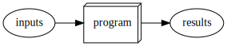
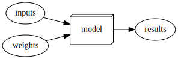
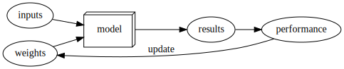
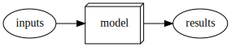
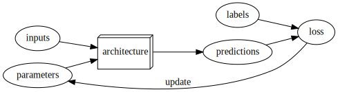
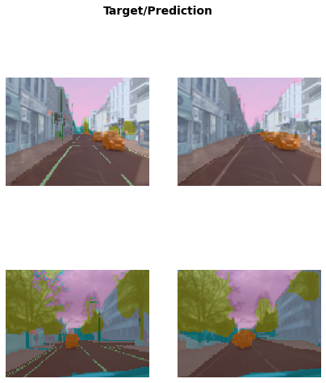

```python
#hide
# ! [ -e /content ] && pip install -Uqq fastbook
import fastbook
fastbook.setup_book()
```


```python
#hide
from fastbook import *
```
[[chapter_intro]]
# Your Deep Learning Journey

Hello, and thank you for letting us join you on your deep learning journey, however far along that you may be! In this chapter, we will tell you a little bit more about what to expect in this book, introduce the key concepts behind deep learning, and train our first models on different tasks. It doesn't matter if you don't come from a technical or a mathematical background (though it's okay if you do too!); we wrote this book to make deep learning accessible to as many people as possible.

## Deep Learning Is for Everyone

A lot of people assume that you need all kinds of hard-to-find stuff to get great results with deep learning, but as you'll see in this book, those people are wrong. <<myths>> is a list of a few thing you *absolutely don't need* to do world-class deep learning.

```asciidoc
[[myths]]
.What you don't need to do deep learning
[options="header"]
|======
| Myth (don't need) | Truth
| Lots of math | Just high school math is sufficient
| Lots of data | We've seen record-breaking results with <50 items of data
| Lots of expensive computers | You can get what you need for state of the art work for free
|======
```

Deep learning is a computer technique to extract and transform data–-with use cases ranging from human speech recognition to animal imagery classification–-by using multiple layers of neural networks. Each of these layers takes its inputs from previous layers and progressively refines them. The layers are trained by algorithms that minimize their errors and improve their accuracy. In this way, the network learns to perform a specified task. We will discuss training algorithms in detail in the next section.

Deep learning has power, flexibility, and simplicity. That's why we believe it should be applied across many disciplines. These include the social and physical sciences, the arts, medicine, finance, scientific research, and many more. To give a personal example, despite having no background in medicine, Jeremy started Enlitic, a company that uses deep learning algorithms to diagnose illness and disease. Within months of starting the company, it was announced that its algorithm could identify malignant tumors [more accurately than radiologists](https://www.nytimes.com/2016/02/29/technology/the-promise-of-artificial-intelligence-unfolds-in-small-steps.html).

Here's a list of some of the thousands of tasks in different areas at which deep learning, or methods heavily using deep learning, is now the best in the world:

- Natural language processing (NLP):: Answering questions; speech recognition; summarizing documents; classifying documents; finding names, dates, etc. in documents; searching for articles mentioning a concept
- Computer vision:: Satellite and drone imagery interpretation (e.g., for disaster resilience); face recognition; image captioning; reading traffic signs; locating pedestrians and vehicles in autonomous vehicles
- Medicine:: Finding anomalies in radiology images, including CT, MRI, and X-ray images; counting features in pathology slides; measuring features in ultrasounds; diagnosing diabetic retinopathy
- Biology:: Folding proteins; classifying proteins; many genomics tasks, such as tumor-normal sequencing and classifying clinically actionable genetic mutations; cell classification; analyzing protein/protein interactions
- Image generation:: Colorizing images; increasing image resolution; removing noise from images; converting images to art in the style of famous artists
- Recommendation systems:: Web search; product recommendations; home page layout
- Playing games:: Chess, Go, most Atari video games, and many real-time strategy games
- Robotics:: Handling objects that are challenging to locate (e.g., transparent, shiny, lacking texture) or hard to pick up
- Other applications:: Financial and logistical forecasting, text to speech, and much more...

What is remarkable is that deep learning has such varied application yet nearly all of deep learning is based on a single type of model, the neural network.

But neural networks are not in fact completely new. In order to have a wider perspective on the field, it is worth it to start with a bit of history.

## Neural Networks: A Brief History

In 1943 Warren McCulloch, a neurophysiologist, and Walter Pitts, a logician, teamed up to develop a mathematical model of an artificial neuron. In their [paper](https://link.springer.com/article/10.1007/BF02478259) "A Logical Calculus of the Ideas Immanent in Nervous Activity" they declared that:

1943 年，神经生理学家沃伦-麦库洛克（Warren McCulloch）和逻辑学家沃尔特-皮茨（Walter Pitts）合作开发了人工神经元的数学模型。在他们的[论文](https://link.springer.com/article/10.1007/BF02478259) "A Logical Calculus of the Ideas Immanent in Nervous Activity" 中，他们声称:

> : Because of the “all-or-none” character of nervous activity, neural events and the relations among them can be treated by means of propositional logic. It is found that the behavior of every net can be described in these terms.

> 由于神经活动具有 "全有或全无 "的特性，因此神经事件及其之间的关系可以通过命题逻辑来处理。我们发现，每个网络的行为都可以用这些术语来描述。

McCulloch and Pitts realized that a simplified model of a real neuron could be represented using simple addition and thresholding, as shown in <<neuron>>. Pitts was self-taught, and by age 12, had received an offer to study at Cambridge University with the great Bertrand Russell. He did not take up this invitation, and indeed throughout his life did not accept any offers of advanced degrees or positions of authority. Most of his famous work was done while he was homeless. Despite his lack of an officially recognized position and increasing social isolation, his work with McCulloch was influential, and was taken up by a psychologist named Frank Rosenblatt.

麦库洛克和皮茨意识到，真实神经元的简化模型可以用简单的加法和阈值来表示，如<<神经元>>所示。皮茨自学成才，12 岁时就收到了去剑桥大学跟随伟大的伯特兰-罗素学习的邀请。他没有接受这个邀请，而且终其一生都没有接受任何高级学位或权威职位的邀请。他的大部分著名作品都是在无家可归时完成的。尽管他没有获得官方认可的职位，而且在社会上越来越孤立，但他与麦库洛克的合作却很有影响力，一位名叫弗兰克-罗森布拉特的心理学家也采用了他的研究成果。


Rosenblatt further developed the artificial neuron to give it the ability to learn. Even more importantly, he worked on building the first device that actually used these principles, the Mark I Perceptron. In "The Design of an Intelligent Automaton" Rosenblatt wrote about this work: "We are now about to witness the birth of such a machine–-a machine capable of perceiving, recognizing and identifying its surroundings without any human training or control." The perceptron was built, and was able to successfully recognize simple shapes.

罗森布拉特进一步开发了人工神经元，使其具备了学习能力。更重要的是，他致力于制造第一个真正使用这些原理的设备--马克 I 感知器。罗森布拉特在《智能自动机的设计》一书中写到了这项工作："我们现在即将见证这样一种机器的诞生--一种无需人类训练或控制就能感知、识别和辨认周围环境的机器"。感知器建成后，能够成功识别简单的形状

An MIT professor named Marvin Minsky (who was a grade behind Rosenblatt at the same high school!), along with Seymour Papert, wrote a book called _Perceptrons_ (MIT Press), about Rosenblatt's invention. They showed that a single layer of these devices was unable to learn some simple but critical mathematical functions (such as XOR). In the same book, they also showed that using multiple layers of the devices would allow these limitations to be addressed. Unfortunately, only the first of these insights was widely recognized. As a result, the global academic community nearly entirely gave up on neural networks for the next two decades.

麻省理工学院一位名叫马文-明斯基的教授（在同一所高中，他比罗森布拉特低一个年级！）与西摩-帕帕特（Seymour Papert）一起，就罗森布拉特的发明写了一本名为《感知器》（Perceptrons）的书（麻省理工学院出版社）。他们发现，这些设备的单层无法学习一些简单但关键的数学函数（如 XOR）。在同一本书中，他们还表明，使用多层设备可以解决这些限制。遗憾的是，只有第一个见解得到了广泛认可。因此，在接下来的二十年里，全球学术界几乎完全放弃了对神经网络的研究。

Perhaps the most pivotal work in neural networks in the last 50 years was the multi-volume *Parallel Distributed Processing* (PDP) by David Rumelhart, James McClellan, and the PDP Research Group, released in 1986 by MIT Press. Chapter 1 lays out a similar hope to that shown by Rosenblatt:

过去 50 年中，神经网络领域最重要的著作或许是大卫-鲁梅尔哈特（David Rumelhart）、詹姆斯-麦克莱伦（James McClellan）和 PDP 研究小组于 1986 年由麻省理工学院出版社出版的多卷本《并行分布式处理》（PDP）。第一章提出了与罗森布拉特类似的希望：

> : People are smarter than today's computers because the brain employs a basic computational architecture that is more suited to deal with a central aspect of the natural information processing tasks that people are so good at. ...We will introduce a computational framework for modeling cognitive processes that seems… closer than other frameworks to the style of computation as it might be done by the brain.
>
> 人之所以比当今的计算机更聪明，是因为大脑采用的基本计算架构更适合处理人所擅长的自然信息处理任务的一个核心方面......我们将介绍一种用于认知过程建模的计算框架，它似乎......比其他框架更接近大脑可能进行的计算方式。

The premise that PDP is using here is that traditional computer programs work very differently to brains, and that might be why computer programs had been (at that point) so bad at doing things that brains find easy (such as recognizing objects in pictures). The authors claimed that the PDP approach was "closer 
than other frameworks" to how the brain works, and therefore it might be better able to handle these kinds of tasks.

PDP 在这里使用的前提是，传统计算机程序的工作原理与大脑非常不同，这可能就是为什么计算机程序（在当时）在做大脑认为容易的事情（如识别图片中的物体）时如此糟糕的原因。作者声称，PDP 方法 "比其他框架 "更接近大脑的工作原理，因此可能更能处理这类任务。

In fact, the approach laid out in PDP is very similar to the approach used in today's neural networks. The book defined parallel distributed processing as requiring:

1. A set of *processing units*
2. A *state of activation*
3. An *output function* for each unit 
4. A *pattern of connectivity* among units 
5. A *propagation rule* for propagating patterns of activities through the network of connectivities 
6. An *activation rule* for combining the inputs impinging on a unit with the current state of that unit to produce an output for the unit
7. A *learning rule* whereby patterns of connectivity are modified by experience 
8. An *environment* within which the system must operate

---

1. 一组 *处理单元* 
2. 一种 *激活状态* 
3. 每个单元的 *输出功能* 
4. 单元间的 *连接模式* 
5. 通过连接网络传播活动模式的 *传播规则* 
6. 一个 *激活规则* ，用于将影响单元的输入与该单元的当前状态相结合，以产生单元的输出 
7. 一个 *学习规则* ，通过经验改变连接模式 
8. 系统必须在其中运行的 *环境*

We will see in this book that modern neural networks handle each of these requirements.

In the 1980's most models were built with a second layer of neurons, thus avoiding the problem that had been identified by Minsky and Papert (this was their "pattern of connectivity among units," to use the framework above). And indeed, neural networks were widely used during the '80s and '90s for real, practical projects. However, again a misunderstanding of the theoretical issues held back the field. In theory, adding just one extra layer of neurons was enough to allow any mathematical function to be approximated with these neural networks, but in practice such networks were often too big and too slow to be useful.

在 1980 年代，大多数模型都是用第二层神经元构建的，从而避免了 Minsky 和 Papert 发现的问题（这是他们的“单元之间的连接模式”，使用上面的框架）。事实上，神经网络在 80 年代和 90 年代被广泛用于实际项目。然而，对理论问题的误解再次阻碍了该领域的发展。从理论上讲，仅仅增加一层额外的神经元就足以让任何数学函数与这些神经网络近似，但在实践中，这种网络往往太大、太慢而没有用。

Although researchers showed 30 years ago that to get practical good performance you need to use even more layers of neurons, it is only in the last decade that this principle has been more widely appreciated and applied. Neural networks are now finally living up to their potential, thanks to the use of more layers, coupled with the capacity to do so due to improvements in computer hardware, increases in data availability, and algorithmic tweaks that allow neural networks to be trained faster and more easily. We now have what Rosenblatt promised: "a machine capable of perceiving, recognizing, and identifying its surroundings without any human training or control."

虽然研究人员在 30 年前就发现，要想获得实际的良好性能，就需要使用更多层的神经元，但直到最近十年，这一原理才得到了更广泛的重视和应用。由于使用了更多的神经元层，再加上计算机硬件的改进、数据可用性的提高以及算法的调整，使得神经网络的训练速度更快、更容易，神经网络现在终于发挥出了自己的潜力。我们现在拥有了罗森布拉特承诺的东西："一台能够感知、识别和辨认周围环境的机器，无需任何人工训练或控制"。

This is what you will learn how to build in this book. But first, since we are going to be spending a lot of time together, let's get to know each other a bit… 

## Who We Are

We are Sylvain and Jeremy, your guides on this journey. We hope that you will find us well suited for this position.

Jeremy has been using and teaching machine learning for around 30 years. He started using neural networks 25 years ago. During this time, he has led many companies and projects that have machine learning at their core, including founding the first company to focus on deep learning and medicine, Enlitic, and taking on the role of President and Chief Scientist of the world's largest machine learning community, Kaggle. He is the co-founder, along with Dr. Rachel Thomas, of fast.ai, the organization that built the course this book is based on.

From time to time you will hear directly from us, in sidebars like this one from Jeremy:

> J: Hi everybody, I'm Jeremy! You might be interested to know that I do not have any formal technical education. I completed a BA, with a major in philosophy, and didn't have great grades. I was much more interested in doing real projects, rather than theoretical studies, so I worked full time at a management consulting firm called McKinsey and Company throughout my university years. If you're somebody who would rather get their hands dirty building stuff than spend years learning abstract concepts, then you will understand where I am coming from! Look out for sidebars from me to find information most suited to people with a less mathematical or formal technical background—that is, people like me…

Sylvain, on the other hand, knows a lot about formal technical education. In fact, he has written 10 math textbooks, covering the entire advanced French maths curriculum!

> S: Unlike Jeremy, I have not spent many years coding and applying machine learning algorithms. Rather, I recently came to the machine learning world, by watching Jeremy's fast.ai course videos. So, if you are somebody who has not opened a terminal and written commands at the command line, then you will understand where I am coming from! Look out for sidebars from me to find information most suited to people with a more mathematical or formal technical background, but less real-world coding experience—that is, people like me…

The fast.ai course has been studied by hundreds of thousands of students, from all walks of life, from all parts of the world. Sylvain stood out as the most impressive student of the course that Jeremy had ever seen, which led to him joining fast.ai, and then becoming the coauthor, along with Jeremy, of the fastai software library.

All this means that between us you have the best of both worlds: the people who know more about the software than anybody else, because they wrote it; an expert on math, and an expert on coding and machine learning; and also people who understand both what it feels like to be a relative outsider in math, and a relative outsider in coding and machine learning.

Anybody who has watched sports knows that if you have a two-person commentary team then you also need a third person to do "special comments." Our special commentator is Alexis Gallagher. Alexis has a very diverse background: he has been a researcher in mathematical biology, a screenplay writer, an improv performer, a McKinsey consultant (like Jeremy!), a Swift coder, and a CTO.

> A: I've decided it's time for me to learn about this AI stuff! After all, I've tried pretty much everything else… But I don't really have a background in building machine learning models. Still… how hard can it be? I'm going to be learning throughout this book, just like you are. Look out for my sidebars for learning tips that I found helpful on my journey, and hopefully you will find helpful too.

## How to Learn Deep Learning

Harvard professor David Perkins, who wrote _Making Learning Whole_ (Jossey-Bass), has much to say about teaching. The basic idea is to teach the *whole game*. That means that if you're teaching baseball, you first take people to a baseball game or get them to play it. You don't teach them how to wind twine to make a baseball from scratch, the physics of a parabola, or the coefficient of friction of a ball on a bat.

哈佛大学教授戴维-珀金斯（David Perkins）撰写了《让学习变得完整》（《Making Learning Whole》，Jossey-Bass 出版社）一书，他对教学有很多独到见解。其基本思想是教授*整个游戏*。也就是说，如果你要教棒球，你首先要带人们去看一场棒球比赛，或者让他们去打棒球。你不会教他们如何从头开始缠绕麻绳制作棒球，也不会教他们抛物线的物理原理，更不会教他们球在球棒上的摩擦系数。

Paul Lockhart, a Columbia math PhD, former Brown professor, and K-12 math teacher, imagines in the influential [essay](https://www.maa.org/external_archive/devlin/LockhartsLament.pdf) "A Mathematician's Lament" a nightmare world where music and art are taught the way math is taught. Children are not allowed to listen to or play music until they have spent over a decade mastering music notation and theory, spending classes transposing sheet music into a different key. In art class, students study colors and applicators, but aren't allowed to actually paint until college. Sound absurd? This is how math is taught–-we require students to spend years doing rote memorization and learning dry, disconnected *fundamentals* that we claim will pay off later, long after most of them quit the subject.

保罗-洛克哈特（Paul Lockhart）是哥伦比亚大学数学博士、前布朗大学教授和 K-12 数学教师，他在颇具影响力的[论文](https://www.maa.org/external_archive/devlin/LockhartsLament.pdf)《数学家的悲歌》中想象了一个噩梦般的世界，在这个世界里，音乐和艺术的教学方式与数学的教学方式如出一辙。孩子们要花上十几年的时间掌握音乐符号和理论，花上几节课的时间把乐谱转成不同的调式，才能听音乐或演奏音乐。在美术课上，学生们学习颜色和涂抹方法，但直到上大学才允许真正作画。听起来荒唐吗？数学就是这样教的--我们要求学生花数年时间死记硬背，学习枯燥的、互不关联的*基础知识，我们声称这些知识日后会有所收获，而大多数学生早已放弃了这门学科。

Unfortunately, this is where many teaching resources on deep learning begin–-asking learners to follow along with the definition of the Hessian and theorems for the Taylor approximation of your loss functions, without ever giving examples of actual working code. We're not knocking calculus. We love calculus, and Sylvain has even taught it at the college level, but we don't think it's the best place to start when learning deep learning!

不幸的是，许多深度学习的教学资源都是从这里开始的--要求学习者跟着学习赫斯的定义和损失函数的泰勒近似定理，却从不给出实际工作代码的例子。我们并不是在贬低微积分。我们热爱微积分，西尔万甚至还在大学里教授过微积分，但我们认为这并不是学习深度学习的最佳起点！

In deep learning, it really helps if you have the motivation to fix your model to get it to do better. That's when you start learning the relevant theory. But you need to have the model in the first place. We teach almost everything through real examples. As we build out those examples, we go deeper and deeper, and we'll show you how to make your projects better and better. This means that you'll be gradually learning all the theoretical foundations you need, in context, in such a way that you'll see why it matters and how it works.

在深度学习中，如果你有动力修正你的模型，让它做得更好，那就真的很有帮助。这就是你开始学习相关理论的时候。但你首先需要拥有模型。我们几乎通过实际案例来教授所有知识。在我们建立这些实例的过程中，我们会越来越深入，向你展示如何把你的项目做得越来越好。这就意味着，你将逐步学习到你所需要的所有理论基础，并结合实际情况，让你明白为什么重要以及如何发挥作用。

So, here's our commitment to you. Throughout this book, we will follow these principles:

- Teaching the *whole game*. We'll start by showing how to use a complete, working, very usable, state-of-the-art deep learning network to solve real-world problems, using simple, expressive tools. And then we'll gradually dig deeper and deeper into understanding how those tools are made, and how the tools that make those tools are made, and so on…
- Always teaching through examples. We'll ensure that there is a context and a purpose that you can understand intuitively, rather than starting with algebraic symbol manipulation.
- Simplifying as much as possible. We've spent years building tools and teaching methods that make previously complex topics very simple.
- Removing barriers. Deep learning has, until now, been a very exclusive game. We're breaking it open, and ensuring that everyone can play.

The hardest part of deep learning is artisanal: how do you know if you've got enough data, whether it is in the right format, if your model is training properly, and, if it's not, what you should do about it? That is why we believe in learning by doing. As with basic data science skills, with deep learning you only get better through practical experience. Trying to spend too much time on the theory can be counterproductive. The key is to just code and try to solve problems: the theory can come later, when you have context and motivation.

深度学习最难的部分在于手工操作：你如何知道自己是否拥有足够的数据、数据格式是否正确、模型是否训练正常，以及如果训练不正常，应该如何处理？这就是我们相信在实践中学习的原因。与基本的数据科学技能一样，深度学习也只有通过实践才能获得更好的效果。试图在理论上花费太多时间可能会适得其反。关键是只需编写代码并尝试解决问题：理论可以在以后，当你有了背景和动力之后再学习。

There will be times when the journey will feel hard. Times where you feel stuck. Don't give up! Rewind through the book to find the last bit where you definitely weren't stuck, and then read slowly through from there to find the first thing that isn't clear. Then try some code experiments yourself, and Google around for more tutorials on whatever the issue you're stuck with is—often you'll find some different angle on the material might help it to click. Also, it's expected and normal to not understand everything (especially the code) on first reading. Trying to understand the material serially before proceeding can sometimes be hard. Sometimes things click into place after you get more context from parts down the road, from having a bigger picture. So if you do get stuck on a section, try moving on anyway and make a note to come back to it later.

旅途中会有感到艰难的时候。有的时候，你会感到被困住。不要放弃！倒带一遍书，找到最后一点你肯定没有卡住的地方，然后从那里慢慢读起，找到第一个不清楚的地方。然后自己尝试一些代码实验，并在谷歌上搜索更多的教程，无论你卡住的是什么问题--通常你会发现，从不同的角度来理解教材可能会让你茅塞顿开。此外，第一次阅读时不理解所有内容（尤其是代码）是意料之中的，也是正常的。在继续学习之前，先尝试理解教材，有时会很困难。有时，当你从后面的部分内容中获得了更多的背景知识，有了更广阔的视野之后，事情就会迎刃而解。因此，如果你在某个部分卡住了，无论如何都要试着继续往下看，并记下稍后再看。

Remember, you don't need any particular academic background to succeed at deep learning. Many important breakthroughs are made in research and industry by folks without a PhD, such as ["Unsupervised Representation Learning with Deep Convolutional Generative Adversarial Networks"](https://arxiv.org/abs/1511.06434)—one of the most influential papers of the last decade—with over 5,000 citations, which was written by Alec Radford when he was an undergraduate. Even at Tesla, where they're trying to solve the extremely tough challenge of making a self-driving car, CEO [Elon Musk says](https://twitter.com/elonmusk/status/1224089444963311616):

请记住，要想在深度学习领域取得成功，你并不需要任何特殊的学术背景。许多重要的科研和产业突破都是由没有博士学位的人取得的，比如 **“利用深度卷积生成对抗网络进行无监督表征学习”** 这篇论文由亚历克-拉德福德（Alec Radford）在读本科时撰写，是过去十年中最具影响力的论文之一，引用次数超过 5000 次。即使在特斯拉，据 CEO 马斯克所说，他们也在努力解决制造自动驾驶汽车这一极其艰巨的挑战。

> : A PhD is definitely not required. All that matters is a deep understanding of AI & ability to implement NNs in a way that is actually useful (latter point is what’s truly hard). Don’t care if you even graduated high school.

What you will need to do to succeed however is to apply what you learn in this book to a personal project, and always persevere.

### Your Projects and Your Mindset

Whether you're excited to identify if plants are diseased from pictures of their leaves, auto-generate knitting patterns, diagnose TB from X-rays, or determine when a raccoon is using your cat door, we will get you using deep learning on your own problems (via pre-trained models from others) as quickly as possible, and then will progressively drill into more details. You'll learn how to use deep learning to solve your own problems at state-of-the-art accuracy within the first 30 minutes of the next chapter! (And feel free to skip straight there now if you're dying to get coding right away.) There is a pernicious myth out there that you need to have computing resources and datasets the size of those at Google to be able to do deep learning, but it's not true.

无论您是想通过植物叶子的图片来识别植物是否生病、自动生成编织图案、通过 X 光片诊断肺结核，还是想确定浣熊何时在使用您的猫门，我们都会让您尽快使用深度学习来解决自己的问题（通过他人提供的预训练模型），然后逐步深入到更多细节。在下一章的前 30 分钟内，你就能学会如何使用深度学习以最先进的精度解决自己的问题！（如果你很想马上开始编码，可以直接跳过这一章）。有一种有害的说法认为，要想进行深度学习，你必须拥有像谷歌那样规模的计算资源和数据集，但事实并非如此。

So, what sorts of tasks make for good test cases? You could train your model to distinguish between Picasso and Monet paintings or to pick out pictures of your daughter instead of pictures of your son. It helps to focus on your hobbies and passions–-setting yourself four or five little projects rather than striving to solve a big, grand problem tends to work better when you're getting started. Since it is easy to get stuck, trying to be too ambitious too early can often backfire. Then, once you've got the basics mastered, aim to complete something you're really proud of!

那么，什么样的任务才是好的测试案例呢？你可以训练你的模型区分毕加索和莫奈的画作，或者挑选出你女儿的照片而不是你儿子的照片。把注意力集中在自己的爱好和激情上会有帮助--给自己设定四五个小项目，而不是努力去解决一个宏大的难题，这样在起步阶段往往会事半功倍。因为很容易陷入困境，过早地雄心勃勃往往会适得其反。然后，一旦你掌握了基础知识，就以完成一件你真正引以为豪的事情为目标！

> J: Deep learning can be set to work on almost any problem. For instance, my first startup was a company called FastMail, which provided enhanced email services when it launched in 1999 (and still does to this day). In 2002 I set it up to use a primitive form of deep learning, single-layer neural networks, to help categorize emails and stop customers from receiving spam.

Common character traits in the people that do well at deep learning include playfulness and curiosity. The late physicist Richard Feynman is an example of someone who we'd expect to be great at deep learning: his development of an understanding of the movement of subatomic particles came from his amusement at how plates wobble when they spin in the air.

善于深度学习的人的共同性格特征包括好玩和好奇。已故物理学家理查德-费曼（Richard Feynman）就是我们期待的善于深度学习的人的一个例子：他对亚原子粒子运动的理解来自于他对盘子在空中旋转时如何摆动的乐趣。

Let's now focus on what you will learn, starting with the software.

## The Software: PyTorch, fastai, and Jupyter

(And Why It Doesn't Matter)

We've completed hundreds of machine learning projects using dozens of different packages, and many different programming languages. At fast.ai, we have written courses using most of the main deep learning and machine learning packages used today. After PyTorch came out in 2017 we spent over a thousand hours testing it before deciding that we would use it for future courses, software development, and research. Since that time PyTorch has become the world's fastest-growing deep learning library and is already used for most research papers at top conferences. This is generally a leading indicator of usage in industry, because these are the papers that end up getting used in products and services commercially. We have found that PyTorch is the most flexible and expressive library for deep learning. It does not trade off speed for simplicity, but provides both.

我们已经使用数十种不同的软件包和多种不同的编程语言完成了数百个机器学习项目。在 fast.ai，我们使用当今使用的大多数主要深度学习和机器学习软件包编写了课程。2017 年 PyTorch 问世后，我们花了一千多个小时对其进行测试，然后决定在未来的课程、软件开发和研究中使用它。从那时起，PyTorch 已成为世界上增长最快的深度学习库，并已被用于顶级会议上的大多数研究论文。这通常是行业使用的领先指标，因为这些论文最终会被用于商业产品和服务中。我们发现，PyTorch 是最灵活、最具表现力的深度学习库。它不会为了简单而牺牲速度，而是两者兼顾。

PyTorch works best as a low-level foundation library, providing the basic operations for higher-level functionality. The fastai library is the most popular library for adding this higher-level functionality on top of PyTorch. It's also particularly well suited to the purposes of this book, because it is unique in providing a deeply layered software architecture (there's even a [peer-reviewed academic paper](https://arxiv.org/abs/2002.04688) about this layered API). In this book, as we go deeper and deeper into the foundations of deep learning, we will also go deeper and deeper into the layers of fastai. This book covers version 2 of the fastai library, which is a from-scratch rewrite providing many unique features.

PyTorch 最适合作为底层基础库，为更高层次的功能提供基本操作。fastai 库是在 PyTorch 基础上添加高级功能最常用的库。它也特别适合本书的目的，因为它在提供深度分层软件架构方面是独一无二的（甚至有一篇[同行评审学术论文](https://arxiv.org/abs/2002.04688)是关于这种分层 API 的）。在本书中，随着我们越来越深入地了解深度学习的基础，我们也将越来越深入地了解 fastai 的各个层次。本书涵盖 fastai 库的第 2 版，这是一个从零开始的重写版本，提供了许多独特的功能

However, it doesn't really matter what software you learn, because it takes only a few days to learn to switch from one library to another. What really matters is learning the deep learning foundations and techniques properly. Our focus will be on using code that clearly expresses the concepts that you need to learn. Where we are teaching high-level concepts, we will use high-level fastai code. Where we are teaching low-level concepts, we will use low-level PyTorch, or even pure Python code.

不过，学习什么软件并不重要，因为从一个库切换到另一个库只需要几天时间。真正重要的是正确学习深度学习的基础和技术。我们的重点是使用能清晰表达你需要学习的概念的代码。在教授高级概念时，我们将使用高级 fastai 代码。在教授低级概念时，我们将使用低级 PyTorch 甚至纯 Python 代码。

If it feels like new deep learning libraries are appearing at a rapid pace nowadays, then you need to be prepared for a much faster rate of change in the coming months and years. As more people enter the field, they will bring more skills and ideas, and try more things. You should assume that whatever specific libraries and software you learn today will be obsolete in a year or two. Just think about the number of changes in libraries and technology stacks that occur all the time in the world of web programming—a much more mature and slow-growing area than deep learning. We strongly believe that the focus in learning needs to be on understanding the underlying techniques and how to apply them in practice, and how to quickly build expertise in new tools and techniques as they are released.

如果说现在新的深度学习库出现的速度很快，那么在未来的几个月和几年里，你需要为更快的变化速度做好准备。随着越来越多的人进入这个领域，他们将带来更多的技能和想法，并尝试更多的东西。你应该假设，无论你今天学习了什么特定的库和软件，一两年后都会过时。试想一下，在网络编程领域，库和技术堆栈的变化无时无刻不在发生，而这个领域比深度学习要成熟得多，发展也缓慢得多。我们坚信，学习的重点需要放在理解底层技术和如何在实践中应用这些技术，以及如何在新工具和新技术发布时快速积累专业知识上。

By the end of the book, you'll understand nearly all the code that's inside fastai (and much of PyTorch too), because in each chapter we'll be digging a level deeper to show you exactly what's going on as we build and train our models. This means that you'll have learned the most important best practices used in modern deep learning—not just how to use them, but how they really work and are implemented. If you want to use those approaches in another framework, you'll have the knowledge you need to do so if needed.

在本书结束时，你将理解 fastai 中的几乎所有代码（以及 PyTorch 中的大部分代码），因为在每一章中，我们都会深入挖掘，向你展示在构建和训练模型时到底发生了什么。这意味着，你将学到现代深度学习中最重要的最佳实践--不仅仅是如何使用它们，而是它们到底是如何工作和实现的。如果您想在其他框架中使用这些方法，您将掌握必要的知识。

Since the most important thing for learning deep learning is writing code and experimenting, it's important that you have a great platform for experimenting with code. The most popular programming experimentation platform is called Jupyter. This is what we will be using throughout this book. We will show you how you can use Jupyter to train and experiment with models and introspect every stage of the data pre-processing and model development pipeline. [Jupyter Notebook](https://jupyter.org/) is the most popular tool for doing data science in Python, for good reason. It is powerful, flexible, and easy to use. We think you will love it!

由于学习深度学习最重要的是编写代码和进行实验，因此拥有一个优秀的代码实验平台非常重要。最流行的编程实验平台叫做 Jupyter。我们在本书中将一直使用它。我们将向你展示如何使用 Jupyter 来训练和实验模型，并对数据预处理和模型开发管道的每个阶段进行自省。[Jupyter Notebook](https://jupyter.org/)是用 Python 进行数据科学研究的最流行工具，这是有道理的。它功能强大、灵活易用。我们认为您会爱上它！

Let's see it in practice and train our first model.

## Your First Model

As we said before, we will teach you how to do things before we explain why they work. Following this top-down approach, we will begin by actually training an image classifier to recognize dogs and cats with almost 100% accuracy. To train this model and run our experiments, you will need to do some initial setup. Don't worry, it's not as hard as it looks.

正如我们之前所说的，我们将先教你怎么做，然后再解释为什么它们能起作用。按照这种自上而下的方法，我们将首先实际训练一个图像分类器，以几乎 100% 的准确率识别猫狗。为了训练这个模型并运行我们的实验，你需要进行一些初始设置。别担心，这并不像看起来那么难。

> s: Do not skip the setup part even if it looks intimidating at first, especially if you have little or no experience using things like a terminal or the command line. Most of that is actually not necessary and you will find that the easiest servers can be set up with just your usual web browser. It is crucial that you run your own experiments in parallel with this book in order to learn.

### Getting a GPU Deep Learning Server

To do nearly everything in this book, you'll need access to a computer with an NVIDIA GPU (unfortunately other brands of GPU are not fully supported by the main deep learning libraries). However, we don't recommend you buy one; in fact, even if you already have one, we don't suggest you use it just yet! Setting up a computer takes time and energy, and you want all your energy to focus on deep learning right now. Therefore, we instead suggest you rent access to a computer that already has everything you need preinstalled and ready to go. Costs can be as little as US$0.25 per hour while you're using it, and some options are even free.

> jargon: Graphics Processing Unit (GPU): Also known as a _graphics card_. A special kind of processor in your computer that can handle thousands of single tasks at the same time, especially designed for displaying 3D environments on a computer for playing games. These same basic tasks are very similar to what neural networks do, such that GPUs can run neural networks hundreds of times faster than regular CPUs. All modern computers contain a GPU, but few contain the right kind of GPU necessary for deep learning.

The best choice of GPU servers to use with this book will change over time, as companies come and go and prices change. We maintain a list of our recommended options on the [book's website](https://book.fast.ai/), so go there now and follow the instructions to get connected to a GPU deep learning server. Don't worry, it only takes about two minutes to get set up on most platforms, and many don't even require any payment, or even a credit card, to get started.

> A: My two cents: heed this advice! If you like computers you will be tempted to set up your own box. Beware! It is feasible but surprisingly involved and distracting. There is a good reason this book is not titled, _Everything You Ever Wanted to Know About Ubuntu System Administration, NVIDIA Driver Installation, apt-get, conda, pip, and Jupyter Notebook Configuration_. That would be a book of its own. Having designed and deployed our production machine learning infrastructure at work, I can testify it has its satisfactions, but it is as unrelated to modeling as maintaining an airplane is to flying one.

Each option shown on the website includes a tutorial; after completing the tutorial, you will end up with a screen looking like <<notebook_init>>.


You are now ready to run your first Jupyter notebook!

> jargon: Jupyter Notebook: A piece of software that allows you to include formatted text, code, images, videos, and much more, all within a single interactive document. Jupyter received the highest honor for software, the ACM Software System Award, thanks to its wide use and enormous impact in many academic fields and in industry. Jupyter Notebook is the software most widely used by data scientists for developing and interacting with deep learning models.

### Running Your First Notebook

The notebooks are labeled by chapter and then by notebook number, so that they are in the same order as they are presented in this book. So, the very first notebook you will see listed is the notebook that you need to use now. You will be using this notebook to train a model that can recognize dog and cat photos. To do this, you'll be downloading a _dataset_ of dog and cat photos, and using that to _train a model_. A dataset is simply a bunch of data—it could be images, emails, financial indicators, sounds, or anything else. There are many datasets made freely available that are suitable for training models. Many of these datasets are created by academics to help advance research, many are made available for competitions (there are competitions where data scientists can compete to see who has the most accurate model!), and some are by-products of other processes (such as financial filings).

> note: Full and Stripped Notebooks: There are two folders containing different versions of the notebooks. The _full_ folder contains the exact notebooks used to create the book you're reading now, with all the prose and outputs. The _stripped_ version has the same headings and code cells, but all outputs and prose have been removed. After reading a section of the book, we recommend working through the stripped notebooks, with the book closed, and seeing if you can figure out what each cell will show before you execute it. Also try to recall what the code is demonstrating.

To open a notebook, just click on it. The notebook will open, and it will look something like <<jupyter>> (note that there may be slight differences in details across different platforms; you can ignore those differences).


A notebook consists of _cells_. There are two main types of cell:

- Cells containing formatted text, images, and so forth. These use a format called *markdown*, which you will learn about soon.
- Cells containing code that can be executed, and outputs will appear immediately underneath (which could be plain text, tables, images, animations, sounds, or even interactive applications).

Jupyter notebooks can be in one of two modes: edit mode or command mode. In edit mode typing on your keyboard enters the letters into the cell in the usual way. However, in command mode, you will not see any flashing cursor, and the keys on your keyboard will each have a special function.

Before continuing, press the Escape key on your keyboard to switch to command mode (if you are already in command mode, this does nothing, so press it now just in case). To see a complete list of all of the functions available, press H; press Escape to remove this help screen. Notice that in command mode, unlike most programs, commands do not require you to hold down Control, Alt, or similar—you simply press the required letter key.

You can make a copy of a cell by pressing C (the cell needs to be selected first, indicated with an outline around it; if it is not already selected, click on it once). Then press V to paste a copy of it.

Click on the cell that begins with the line "# CLICK ME" to select it. The first character in that line indicates that what follows is a comment in Python, so it is ignored when executing the cell. The rest of the cell is, believe it or not, a complete system for creating and training a state-of-the-art model for recognizing cats versus dogs. So, let's train it now! To do so, just press Shift-Enter on your keyboard, or press the Play button on the toolbar. Then wait a few minutes while the following things happen:

1. A dataset called the [Oxford-IIIT Pet Dataset](http://www.robots.ox.ac.uk/~vgg/data/pets/) that contains 7,349 images of cats and dogs from 37 different breeds will be downloaded from the fast.ai datasets collection to the GPU server you are using, and will then be extracted.
2. A *pretrained model* that has already been trained on 1.3 million images, using a competition-winning model will be downloaded from the internet.
3. The pretrained model will be *fine-tuned* using the latest advances in transfer learning, to create a model that is specially customized for recognizing dogs and cats.

The first two steps only need to be run once on your GPU server. If you run the cell again, it will use the dataset and model that have already been downloaded, rather than downloading them again. Let's take a look at the contents of the cell, and the results (<<first_training>>):

---

单击以 "# CLICK ME "开头的单元格，将其选中。该行的第一个字符表示后面的内容是 Python 中的注释，因此在执行单元格时会忽略它。信不信由你，单元格的其余部分是一个完整的系统，用于创建和训练最先进的猫狗识别模型。那么，我们现在就来训练它！为此，只需按下键盘上的 Shift-Enter 键，或按下工具栏上的 "播放 "按钮。然后等待几分钟，下面的事情就会发生：

1. 一个名为[Oxford-IIIT Pet Dataset]（http://www.robots.ox.ac.uk/~vgg/data/pets/）的数据集将从 fast.ai 数据集集合下载到您正在使用的 GPU 服务器，该数据集包含来自 37 个不同品种的 7349 张猫和狗的图像，然后将被提取出来。
2. 将从互联网上下载一个*预训练模型*，该模型已在 130 万张图像上使用一个竞赛获奖模型进行过训练。
3. 将利用迁移学习的最新进展对预训练模型进行*微调，以创建一个专门用于识别猫狗的模型。

前两个步骤只需在 GPU 服务器上运行一次。如果您再次运行该单元，它将使用已经下载的数据集和模型，而不是再次下载。让我们来看看单元格的内容和结果（<<first_training>>）：


```python
#id first_training
#caption Results from the first training
# CLICK ME
from fastai.vision.all import *
path = untar_data(URLs.PETS)/'images'

def is_cat(x): return x[0].isupper()
dls = ImageDataLoaders.from_name_func(
    path, get_image_files(path), valid_pct=0.2, seed=42,
    label_func=is_cat, item_tfms=Resize(224))

learn = vision_learner(dls, resnet34, metrics=error_rate)
learn.fine_tune(1)
```


<table border="1" class="dataframe">
  <thead>
    <tr style="text-align: left;">
      <th>epoch</th>
      <th>train_loss</th>
      <th>valid_loss</th>
      <th>error_rate</th>
      <th>time</th>
    </tr>
  </thead>
  <tbody>
    <tr>
      <td>0</td>
      <td>0.180385</td>
      <td>0.023942</td>
      <td>0.006766</td>
      <td>00:16</td>
    </tr>
  </tbody>
</table>


<table border="1" class="dataframe">
  <thead>
    <tr style="text-align: left;">
      <th>epoch</th>
      <th>train_loss</th>
      <th>valid_loss</th>
      <th>error_rate</th>
      <th>time</th>
    </tr>
  </thead>
  <tbody>
    <tr>
      <td>0</td>
      <td>0.056023</td>
      <td>0.007580</td>
      <td>0.004060</td>
      <td>00:20</td>
    </tr>
  </tbody>
</table>


You will probably not see exactly the same results that are in the book. There are a lot of sources of small random variation involved in training models. We generally see an error rate of well less than 0.02 in this example, however.

> important: Training Time: Depending on your network speed, it might take a few minutes to download the pretrained model and dataset. Running `fine_tune` might take a minute or so. Often models in this book take a few minutes to train, as will your own models, so it's a good idea to come up with good techniques to make the most of this time. For instance, keep reading the next section while your model trains, or open up another notebook and use it for some coding experiments.

### Sidebar: This Book Was Written in Jupyter Notebooks

We wrote this book using Jupyter notebooks, so for nearly every chart, table, and calculation in this book, we'll be showing you the exact code required to replicate it yourself. That's why very often in this book, you will see some code immediately followed by a table, a picture or just some text. If you go on the [book's website](https://book.fast.ai) you will find all the code, and you can try running and modifying every example yourself.

You just saw how a cell that outputs a table looks inside the book. Here is an example of a cell that outputs text:


```python
1+1
```


    2


Jupyter will always print or show the result of the last line (if there is one). For instance, here is an example of a cell that outputs an image:


```python
img = PILImage.create(image_cat())
img.to_thumb(192)
```


​    

​    


### End sidebar

So, how do we know if this model is any good? In the last column of the table you can see the error rate, which is the proportion of images that were incorrectly identified. The error rate serves as our metric—our measure of model quality, chosen to be intuitive and comprehensible. As you can see, the model is nearly perfect, even though the training time was only a few seconds (not including the one-time downloading of the dataset and the pretrained model). In fact, the accuracy you've achieved already is far better than anybody had ever achieved just 10 years ago!

Finally, let's check that this model actually works. Go and get a photo of a dog, or a cat; if you don't have one handy, just search Google Images and download an image that you find there. Now execute the cell with `uploader` defined. It will output a button you can click, so you can select the image you want to classify:


```python
#hide_output
uploader = widgets.FileUpload()
uploader
```


    FileUpload(value={}, description='Upload')


Now you can pass the uploaded file to the model. Make sure that it is a clear photo of a single dog or a cat, and not a line drawing, cartoon, or similar. The notebook will tell you whether it thinks it is a dog or a cat, and how confident it is. Hopefully, you'll find that your model did a great job:


```python
#hide
# For the book, we can't actually click an upload button, so we fake it
uploader = SimpleNamespace(data = ['images/chapter1_cat_example.jpg'])
```


```python
img = PILImage.create(uploader.data[0])
is_cat,_,probs = learn.predict(img)
print(f"Is this a cat?: {is_cat}.")
print(f"Probability it's a cat: {probs[1].item():.6f}")
```


    Is this a cat?: True.
    Probability it's a cat: 1.000000


Congratulations on your first classifier!

But what does this mean? What did you actually do? In order to explain this, let's zoom out again to take in the big picture. 

### What Is Machine Learning?

Your classifier is a deep learning model. As was already mentioned, deep learning models use neural networks, which originally date from the 1950s and have become powerful very recently thanks to recent advancements.

Another key piece of context is that deep learning is just a modern area in the more general discipline of *machine learning*. To understand the essence of what you did when you trained your own classification model, you don't need to understand deep learning. It is enough to see how your model and your training process are examples of the concepts that apply to machine learning in general.

So in this section, we will describe what machine learning is. We will look at the key concepts, and show how they can be traced back to the original essay that introduced them.

*Machine learning* is, like regular programming, a way to get computers to complete a specific task. But how would we use regular programming to do what we just did in the last section: recognize dogs versus cats in photos? We would have to write down for the computer the exact steps necessary to complete the task.

Normally, it's easy enough for us to write down the steps to complete a task when we're writing a program. We just think about the steps we'd take if we had to do the task by hand, and then we translate them into code. For instance, we can write a function that sorts a list. In general, we'd write a function that looks something like <<basic_program>> (where *inputs* might be an unsorted list, and *results* a sorted list).

---

您的分类器是一个深度学习模型。正如前面提到的，深度学习模型使用的是神经网络，这种网络最早可以追溯到 20 世纪 50 年代，由于最近的进步而变得非常强大。

另一个关键的背景是，深度学习只是机器学习这一更广泛学科中的一个现代领域。要理解你在训练自己的分类模型时所做工作的本质，你并不需要了解深度学习。只要了解你的模型和训练过程是如何应用于一般机器学习概念的例子就足够了。

因此，在本节中，我们将介绍什么是机器学习。我们将审视关键概念，并说明如何将它们追溯到引入这些概念的原始论文。

*机器学习*和普通编程一样，是一种让计算机完成特定任务的方法。但是，我们如何使用常规编程来完成上一节中的任务：识别照片中的狗和猫？我们必须为计算机写下完成任务所需的确切步骤。

通常，我们在编写程序时很容易写下完成任务的步骤。我们只要想一想，如果我们必须手工完成任务，我们会采取哪些步骤，然后将它们转化为代码。例如，我们可以编写一个对列表排序的函数。一般来说，我们会写一个类似 <<basic_program>> 的函数（其中 *inputs* 可能是一个未排序的列表，而 *results* 则是一个已排序的列表）。


```python
#hide_input
#caption A traditional program
#id basic_program
#alt Pipeline inputs, program, results
gv('''program[shape=box3d width=1 height=0.7]
inputs->program->results''')
```


​    

​    


But for recognizing objects in a photo that's a bit tricky; what *are* the steps we take when we recognize an object in a picture? We really don't know, since it all happens in our brain without us being consciously aware of it!

Right back at the dawn of computing, in 1949, an IBM researcher named Arthur Samuel started working on a different way to get computers to complete tasks, which he called *machine learning*. In his classic 1962 essay "Artificial Intelligence: A Frontier of Automation", he wrote:

---

但是，对于识别照片中的物体来说，这就有点棘手了；当我们识别照片中的物体时，我们**采取的步骤是什么？我们真的不知道，因为这一切都发生在我们的大脑中，而我们却没有意识到！

早在计算机诞生之初的1949年，IBM一位名叫阿瑟-塞缪尔的研究员就开始研究一种让计算机完成任务的不同方法，他称之为*机器学习*。他在 1962 年发表的经典论文《人工智能：自动化的前沿》中写道自动化的前沿》一文中写道如下内容：

> : Programming a computer for such computations is, at best, a difficult task, not primarily because of any inherent complexity in the computer itself but, rather, because of the need to spell out every minute step of the process in the most exasperating detail. Computers, as any programmer will tell you, are giant morons, not giant brains.

---

>：为此类计算编写计算机程序充其量只是一项艰巨的任务，这主要不是因为计算机本身有任何固有的复杂性，而是因为需要最令人恼火地详细说明过程中的每一个微小步骤。任何程序员都会告诉你，计算机是巨大的白痴，而不是巨大的大脑。

His basic idea was this: instead of telling the computer the exact steps required to solve a problem, show it examples of the problem to solve, and let it figure out how to solve it itself. This turned out to be very effective: by 1961 his checkers-playing program had learned so much that it beat the Connecticut state champion! Here's how he described his idea (from the same essay as above):

---

他的基本想法是：与其告诉计算机解决问题所需的确切步骤，不如向它展示要解决问题的示例，让它自己找出解决问题的方法。结果证明这个方法非常有效：到 1961 年，他的跳棋程序已经学会了很多东西，以至于击败了康涅狄格州的冠军！以下是他对自己想法的描述（摘自上文同一篇文章）：

> : Suppose we arrange for some automatic means of testing the effectiveness of any current weight assignment in terms of actual performance and provide a mechanism for altering the weight assignment so as to maximize the performance. We need not go into the details of such a procedure to see that it could be made entirely automatic and to see that a machine so programmed would "learn" from its experience.

---

> 假设我们安排了某种自动手段，以测试当前权重分配在实际性能方面的有效性，并提供了一种改变权重分配的机制，以便最大限度地提高性能。我们不需要深入探讨这种程序的细节，就可以知道它可以完全自动完成，而且这样编程的机器会从它的经验中 "学习"。

There are a number of powerful concepts embedded in this short statement: 

- The idea of a "weight assignment" 
- The fact that every weight assignment has some "actual performance"
- The requirement that there be an "automatic means" of testing that performance,  
- The need for a "mechanism" (i.e., another automatic process) for improving the performance by changing the weight assignments

Let us take these concepts one by one, in order to understand how they fit together in practice. First, we need to understand what Samuel means by a *weight assignment*.

Weights are just variables, and a weight assignment is a particular choice of values for those variables. The program's inputs are values that it processes in order to produce its results—for instance, taking image pixels as inputs, and returning the classification "dog" as a result. The program's weight assignments are other values that define how the program will operate.

Since they will affect the program they are in a sense another kind of input, so we will update our basic picture in <<basic_program>> and replace it with <<weight_assignment>> in order to take this into account.

---

这句简短的话蕴含着许多强有力的概念：

- " 权重分配 "的概念
- 每个权重分配都有一定的 "实际性能 "这一事实
- 要求有一种 "自动方法 "来测试这种性能、
- 需要一种 "机制"（即另一种自动程序），通过改变权重分配来提高性能

让我们逐一讨论这些概念，以了解它们在实践中是如何结合在一起的。首先，我们需要了解塞缪尔所说的 "权重分配 "是什么意思。

权重只是变量，而权重分配则是对这些变量值的特定选择。程序的输入是它为产生结果而处理的值--例如，将图像像素作为输入，并返回分类结果 "狗"。程序的权重分配是定义程序运行方式的其他值。

由于权重赋值会影响程序的运行，因此从某种意义上说，它们也是另一种输入，因此我们将更新 <<basic_program>> 中的基本图片，并将其替换为 <<weight_assignment>>，以便将这一点考虑在内。


```python
#hide_input
#caption A program using weight assignment
#id weight_assignment
gv('''model[shape=box3d width=1 height=0.7]
inputs->model->results; weights->model''')
```


​    

​    


We've changed the name of our box from *program* to *model*. This is to follow modern terminology and to reflect that the *model* is a special kind of program: it's one that can do *many different things*, depending on the *weights*. It can be implemented in many different ways. For instance, in Samuel's checkers program, different values of the weights would result in different checkers-playing strategies. 

(By the way, what Samuel called "weights" are most generally referred to as model *parameters* these days, in case you have encountered that term. The term *weights* is reserved for a particular type of model parameter.)

Next, Samuel said we need an *automatic means of testing the effectiveness of any current weight assignment in terms of actual performance*. In the case of his checkers program, the "actual performance" of a model would be how well it plays. And you could automatically test the performance of two models by setting them to play against each other, and seeing which one usually wins.

Finally, he says we need *a mechanism for altering the weight assignment so as to maximize the performance*. For instance, we could look at the difference in weights between the winning model and the losing model, and adjust the weights a little further in the winning direction.

We can now see why he said that such a procedure *could be made entirely automatic and... a machine so programmed would "learn" from its experience*. Learning would become entirely automatic when the adjustment of the weights was also automatic—when instead of us improving a model by adjusting its weights manually, we relied on an automated mechanism that produced adjustments based on performance.

<<training_loop>> shows the full picture of Samuel's idea of training a machine learning model.

---

我们把盒子的名称从 "程序 "改为 "模型"。这样做是为了遵循现代术语，并反映出*模型*是一种特殊的程序：根据*权重*，它可以做*多种不同的事情*。它可以以多种不同的方式实现。例如，在塞缪尔的跳棋程序中，不同的权重值会产生不同的跳棋策略。

(顺便说一句，塞缪尔所说的 "权重 "如今一般被称为模型的 "参数"，如果你用过这个词的话。*权重* "一词是为一种特殊类型的模型参数保留的）。

接下来，塞缪尔说我们需要一种*自动的方法来测试当前权重分配在实际性能方面*的有效性。就他的跳棋程序而言，模型的 "实际性能 "就是它的下棋水平。你可以自动测试两个模型的性能，方法是设置它们相互对弈，看看哪个模型通常会赢。

最后，他说我们需要*一种机制来改变权重分配，从而使性能*最大化。例如，我们可以查看获胜模型和失败模型之间的权重差异，然后向获胜方向调整权重。

我们现在可以理解为什么他说这样的程序*可以完全自动完成，而且......这样编程的机器会从经验中 "学习 "*。当权重的调整也是自动的时候，学习就会变得完全自动--我们不再通过手动调整权重来改进模型，而是依靠一种自动机制，根据表现进行调整。

<<training_loop>>展示了塞缪尔训练机器学习模型的全貌。


```python
#hide_input
#caption Training a machine learning model
#id training_loop
#alt The basic training loop
gv('''ordering=in
model[shape=box3d width=1 height=0.7]
inputs->model->results; weights->model; results->performance
performance->weights[constraint=false label=update]''')
```


​    

​    


Notice the distinction between the model's *results*  (e.g., the moves in a checkers game) and its *performance* (e.g., whether it wins the game, or how quickly it wins). 

Also note that once the model is trained—that is, once we've chosen our final, best, favorite weight assignment—then we can think of the weights as being *part of the model*, since we're not varying them any more.

Therefore, actually *using* a model after it's trained looks like <<using_model>>.

---

注意模型的*结果*（如跳棋游戏中的走法）和*性能*（如是否赢得游戏，或赢得游戏的速度）之间的区别。

还要注意的是，一旦模型训练完成，也就是说，一旦我们选择了最终的、最好的、最喜欢的权重分配，我们就可以认为权重是模型的*一部分，因为我们不再改变权重了。

因此，在模型训练完成后，实际*使用*模型就像<<using_model>>。


```python
#hide_input
#caption Using a trained model as a program
#id using_model
gv('''model[shape=box3d width=1 height=0.7]
inputs->model->results''')
```


​    

​    


This looks identical to our original diagram in <<basic_program>>, just with the word *program* replaced with *model*. This is an important insight: *a trained model can be treated just like a regular computer program*.

---

这看起来与 <<basic_program>> 中的原图完全相同，只是 *program* 一词被 *model* 所取代。这是一个重要的启示：*一个训练有素的模型就像一个普通的计算机程序*。

> jargon: Machine Learning: The training of programs developed by allowing a computer to learn from its experience, rather than through manually coding the individual steps.

---

> 行话：机器学习：通过让计算机从自身经验中学习而非手动编码各个步骤来开发的程序训练。

### What Is a Neural Network?

It's not too hard to imagine what the model might look like for a checkers program. There might be a range of checkers strategies encoded, and some kind of search mechanism, and then the weights could vary how strategies are selected, what parts of the board are focused on during a search, and so forth. But it's not at all obvious what the model might look like for an image recognition program, or for understanding text, or for many other interesting problems we might imagine.

What we would like is some kind of function that is so flexible that it could be used to solve any given problem, just by varying its weights. Amazingly enough, this function actually exists! It's the neural network, which we already discussed. That is, if you regard a neural network as a mathematical function, it turns out to be a function which is extremely flexible depending on its weights. A mathematical proof called the *universal approximation theorem* shows that this function can solve any problem to any level of accuracy, in theory. The fact that neural networks are so flexible means that, in practice, they are often a suitable kind of model, and you can focus your effort on the process of training them—that is, of finding good weight assignments.

But what about that process?  One could imagine that you might need to find a new "mechanism" for automatically updating weights for every problem. This would be laborious. What we'd like here as well is a completely general way to update the weights of a neural network, to make it improve at any given task. Conveniently, this also exists!

This is called *stochastic gradient descent* (SGD). We'll see how neural networks and SGD work in detail in <<chapter_mnist_basics>>, as well as explaining the universal approximation theorem. For now, however, we will instead use Samuel's own words: *We need not go into the details of such a procedure to see that it could be made entirely automatic and to see that a machine so programmed would "learn" from its experience.*

---

不难想象跳棋程序的模型会是什么样子。可能会有一系列跳棋策略编码，以及某种搜索机制，然后权重可以改变策略的选择方式、搜索过程中关注棋盘的哪些部分等等。但是，对于图像识别程序、理解文本或我们可能想象到的许多其他有趣的问题来说，这个模型可能是什么样的，这一点都不明显。

我们需要的是一种非常灵活的函数，只要改变它的权重，就能解决任何问题。令人惊奇的是，这种函数确实存在！这就是我们已经讨论过的神经网络。也就是说，如果你把神经网络看作一个数学函数，那么它就会变成一个根据权重而极其灵活的函数。一个名为 "通用近似定理 "*的数学证明表明，从理论上讲，这个函数可以以任何精度解决任何问题。神经网络如此灵活这一事实意味着，在实践中，神经网络通常是一种合适的模型，你可以将精力集中在训练神经网络的过程中，也就是找到好的权重分配。

但这个过程又是怎样的呢？  我们可以想象，你可能需要找到一种新的 "机制 "来自动更新每个问题的权重。这将非常费力。在这里，我们也希望有一种完全通用的方法来更新神经网络的权重，使其在任何给定任务中都能有所改进。方便的是，这种方法也是存在的！

这就是*随机梯度下降*（SGD）。我们将在 <<chapter_mnist_basics>> 中详细介绍神经网络和 SGD 的工作原理，并解释普遍逼近定理。不过，现在我们将使用塞缪尔自己的话：*我们不需要深入研究这种程序的细节，就能知道它可以完全自动完成，也能知道这样编程的机器会从它的经验中 "学习 "*。

> J: Don't worry, neither SGD nor neural nets are mathematically complex. Both nearly entirely rely on addition and multiplication to do their work (but they do a _lot_ of addition and multiplication!). The main reaction we hear from students when they see the details is: "Is that all it is?"

---

> J：别担心，SGD 和神经网络在数学上都不复杂。两者都几乎完全依靠加法和乘法来完成工作（但它们要做_大量的加法和乘法！）。当学生们看到这些细节时，他们的主要反应是"就这么简单？

In other words, to recap, a neural network is a particular kind of machine learning model, which fits right in to Samuel's original conception. Neural networks are special because they are highly flexible, which means they can solve an unusually wide range of problems just by finding the right weights. This is powerful, because stochastic gradient descent provides us a way to find those weight values automatically.

Having zoomed out, let's now zoom back in and revisit our image classification problem using Samuel's framework.

Our inputs are the images. Our weights are the weights in the neural net. Our model is a neural net. Our results are the values that are calculated by the neural net, like "dog" or "cat."

What about the next piece, an *automatic means of testing the effectiveness of any current weight assignment in terms of actual performance*? Determining "actual performance" is easy enough: we can simply define our model's performance as its accuracy at predicting the correct answers.

Putting this all together, and assuming that SGD is our mechanism for updating the weight assignments, we can see how our image classifier is a machine learning model, much like Samuel envisioned.

---

换句话说，神经网络是一种特殊的机器学习模型，与塞缪尔最初的概念不谋而合。神经网络之所以特殊，是因为它们具有高度灵活性，这意味着只需找到正确的权重，它们就能解决异常广泛的问题。这一点非常强大，因为随机梯度下降为我们提供了一种自动寻找权重值的方法。

在放大之后，现在让我们重新放大，使用塞缪尔的框架来重温我们的图像分类问题。

我们的输入是图像。我们的权重是神经网络中的权重。我们的模型是神经网络。我们的结果是神经网络计算出的值，如 "狗 "或 "猫"。

那么下一部分呢，即根据实际性能*自动测试当前权重分配有效性的*方法？确定 "实际性能 "非常简单：我们可以简单地将模型的性能定义为预测正确答案的准确性。

综上所述，并假设 SGD 是我们更新权重分配的机制，我们就可以看到我们的图像分类器是一个机器学习模型，这与塞缪尔的设想非常相似。

### A Bit of Deep Learning Jargon（一些深度学习的术语）

Samuel was working in the 1960s, and since then terminology has changed. Here is the modern deep learning terminology for all the pieces we have discussed:

- The functional form of the *model* is called its *architecture* (but be careful—sometimes people use *model* as a synonym of *architecture*, so this can get confusing).
- The *weights* are called *parameters*.
- The *predictions* are calculated from the *independent variable*, which is the *data* not including the *labels*.
- The *results* of the model are called *predictions*.
- The measure of *performance* is called the *loss*.
- The loss depends not only on the predictions, but also the correct *labels* (also known as *targets* or the *dependent variable*); e.g., "dog" or "cat."

After making these changes, our diagram in <<training_loop>> looks like <<detailed_loop>>.

---

塞缪尔是在 20 世纪 60 年代工作的，从那时起，术语已经发生了变化。以下是我们讨论过的所有内容的现代深度学习术语：

- *模型* 的功能形式被称为其 *架构*（但要小心--有时人们会把 *模型* 当作 *架构* 的同义词来使用，因此这可能会引起混淆）。
- *权重* 称为 *参数*。
- *预测值*是根据*自变量*计算得出的，而*自变量*是不包括*标签*的*数据*。
- 模型的 *结果* 称为 *预测值* 。
- 衡量 *性能* 的指标称为 *损失* 。
- 损失不仅取决于预测结果，还取决于正确的*标签*（也称为*目标*或*自变量*）；例如，"狗 "或 "猫"。

进行这些更改后，我们在 <<training_loop>> 中的图表看起来就像 <<detailed_loop>>。


```python
#hide_input
#caption Detailed training loop
#id detailed_loop
gv('''ordering=in
model[shape=box3d width=1 height=0.7 label=architecture]
inputs->model->predictions; parameters->model; labels->loss; predictions->loss
loss->parameters[constraint=false label=update]''')
```


​    

​    


### Limitations Inherent To Machine Learning

From this picture we can now see some fundamental things about training a deep learning model:

- A model cannot be created without data.
- A model can only learn to operate on the patterns seen in the input data used to train it.
- This learning approach only creates *predictions*, not recommended *actions*.
- It's not enough to just have examples of input data; we need *labels* for that data too (e.g., pictures of dogs and cats aren't enough to train a model; we need a label for each one, saying which ones are dogs, and which are cats).

Generally speaking, we've seen that most organizations that say they don't have enough data, actually mean they don't have enough *labeled* data. If any organization is interested in doing something in practice with a model, then presumably they have some inputs they plan to run their model against. And presumably they've been doing that some other way for a while (e.g., manually, or with some heuristic program), so they have data from those processes! For instance, a radiology practice will almost certainly have an archive of medical scans (since they need to be able to check how their patients are progressing over time), but those scans may not have structured labels containing a list of diagnoses or interventions (since radiologists generally create free-text natural language reports, not structured data). We'll be discussing labeling approaches a lot in this book, because it's such an important issue in practice.

Since these kinds of machine learning models can only make *predictions* (i.e., attempt to replicate labels), this can result in a significant gap between organizational goals and model capabilities. For instance, in this book you'll learn how to create a *recommendation system* that can predict what products a user might purchase. This is often used in e-commerce, such as to customize products shown on a home page by showing the highest-ranked items. But such a model is generally created by looking at a user and their buying history (*inputs*) and what they went on to buy or look at (*labels*), which means that the model is likely to tell you about products the user already has or already knows about, rather than new products that they are most likely to be interested in hearing about. That's very different to what, say, an expert at your local bookseller might do, where they ask questions to figure out your taste, and then tell you about authors or series that you've never heard of before.

---

#### 机器学习固有的局限性

从这幅图中，我们可以看到训练深度学习模型的一些基本要素：

- 模型的创建离不开数据。
- 模型只能根据用于训练它的输入数据中的模式来学习操作。
- 这种学习方法只能创建*预测*，而不是推荐*操作*。
- 仅有输入数据的示例是不够的；我们还需要这些数据的*标签*（例如，狗和猫的图片不足以训练模型；我们需要为每张图片加上标签，说明哪些是狗，哪些是猫）。

一般来说，我们看到大多数组织说他们没有足够的数据，实际上是指他们没有足够的*标签*数据。如果任何组织有兴趣用一个模型来做一些实际工作，那么他们肯定会有一些输入数据来运行他们的模型。而且，他们可能已经用其他方法（如手动或启发式程序）做了一段时间，因此他们拥有这些过程中产生的数据！例如，放射科几乎肯定会有医学扫描档案（因为他们需要检查病人的病情进展情况），但这些扫描可能没有包含诊断或干预列表的结构化标签（因为放射科医生通常创建的是自由文本自然语言报告，而不是结构化数据）。我们将在本书中多次讨论标签方法，因为这在实践中是一个非常重要的问题。

由于这类机器学习模型只能进行*预测（即试图复制标签）*，这可能导致组织目标与模型能力之间存在巨大差距。例如，在本书中，你将学习如何创建一个*推荐系统，以预测用户可能购买的产品。这通常用于电子商务，例如通过显示排名最高的商品来定制主页上显示的商品。但这种模型通常是通过查看用户及其购买历史（*输入*）以及他们继续购买或查看的商品（*标签*）来创建的，这意味着该模型很可能会告诉你用户已经拥有或已经知道的商品，而不是他们最有可能感兴趣的新商品。这与本地书商的专家所做的工作截然不同，他们会通过提问来了解你的品味，然后向你介绍你从未听说过的作家或系列作品。

Another critical insight comes from considering how a model interacts with its environment. This can create *feedback loops*, as described here:

- A *predictive policing* model is created based on where arrests have been made in the past. In practice, this is not actually predicting crime, but rather predicting arrests, and is therefore partially simply reflecting biases in existing policing processes.
- Law enforcement officers then might use that model to decide where to focus their police activity, resulting in increased arrests in those areas.
- Data on these additional arrests would then be fed back in to retrain future versions of the model.

This is a *positive feedback loop*, where the more the model is used, the more biased the data becomes, making the model even more biased, and so forth.

Feedback loops can also create problems in commercial settings. For instance, a video recommendation system might be biased toward recommending content consumed by the biggest watchers of video (e.g., conspiracy theorists and extremists tend to watch more online video content than the average), resulting in those users increasing their video consumption, resulting in more of those kinds of videos being recommended. We'll consider this topic more in detail in <<chapter_ethics>>.

---

另一个关键的见解来自考虑模型如何与其环境交互。这可以创建*反馈循环*，如下所述：

- 根据过去逮捕的地方创建*预测性警务*模型。在实践中，这实际上并不是在预测犯罪，而是在预测逮捕，因此在一定程度上只是反映了现有警务过程中的偏见。
- 然后，执法人员可能会使用该模型来决定将警察活动的重点放在何处，从而导致这些地区的逮捕人数增加。
- 然后，有关这些额外逮捕的数据将被反馈，以重新训练模型的未来版本。

这是一个*正反馈循环*，其中模型使用得越多，数据就越有偏差，使模型更加有偏差，依此类推。

反馈循环也会在商业环境中产生问题。例如，视频推荐系统可能偏向于推荐视频观看者最大的观看者消费的内容（例如，阴谋论者和极端分子倾向于观看比平均水平更多的在线视频内容），导致这些用户增加他们的视频消费，从而导致更多此类视频被推荐。我们将在<>中更详细地讨论这个主题<chapter_ethics>。

Now that you have seen the base of the theory, let's go back to our code example and see in detail how the code corresponds to the process we just described.

---

现在您已经了解了理论的基础，让我们回到我们的代码示例，详细了解代码如何与我们刚才描述的过程相对应。

### How Our Image Recognizer Works

Let's see just how our image recognizer code maps to these ideas. We'll put each line into a separate cell, and look at what each one is doing (we won't explain every detail of every parameter yet, but will give a description of the important bits; full details will come later in the book).

---

让我们看看我们的图像识别器代码如何映射到这些想法。我们将把每一行放在一个单独的单元格中，看看每一行在做什么（我们不会解释每个参数的每个细节，但会给出重要部分的描述;完整的细节将在本书后面介绍）。

The first line imports all of the fastai.vision library.

```python
from fastai.vision.all import *
```

This gives us all of the functions and classes we will need to create a wide variety of computer vision models.

> J: A lot of Python coders recommend avoiding importing a whole library like this (using the `import *` syntax), because in large software projects it can cause problems. However, for interactive work such as in a Jupyter notebook, it works great. The fastai library is specially designed to support this kind of interactive use, and it will only import the necessary pieces into your environment.

The second line downloads a standard dataset from the [fast.ai datasets collection](https://course.fast.ai/datasets) (if not previously downloaded) to your server, extracts it (if not previously extracted), and returns a `Path` object with the extracted location:

```python
path = untar_data(URLs.PETS)/'images'
```

> S: Throughout my time studying at fast.ai, and even still today, I've learned a lot about productive coding practices. The fastai library and fast.ai notebooks are full of great little tips that have helped make me a better programmer. For instance, notice that the fastai library doesn't just return a string containing the path to the dataset, but a `Path` object. This is a really useful class from the Python 3 standard library that makes accessing files and directories much easier. If you haven't come across it before, be sure to check out its documentation or a tutorial and try it out. Note that the https://book.fast.ai[website] contains links to recommended tutorials for each chapter. I'll keep letting you know about little coding tips I've found useful as we come across them.

---

第二行将标准数据集从 [fast.ai 数据集集合](https://course.fast.ai/datasets)（如果以前未下载）下载到您的服务器，提取它（如果以前未提取），并返回一个包含提取位置的“Path”对象：

```python
path = untar_data(URLs.PETS)/'images'
```

> S：在我在 fast.ai 学习期间，直到今天，我学到了很多关于高效编码实践的知识。fastai 库和 fast.ai 笔记本充满了很棒的小技巧，这些技巧帮助我成为一名更好的程序员。
> 
> 例如，请注意，fastai 库不仅返回一个包含数据集路径的字符串，还返回一个 `Path` 对象。这是 Python 3 标准库中一个非常有用的类，它使访问文件和目录变得更加容易。如果您以前没有遇到过它，请务必查看其文档或教程并尝试一下。请注意，https://book.fast.ai[website] 包含指向每个章节的推荐教程的链接。当我们遇到一些我发现有用的编码技巧时，我会继续让你知道它们。

In the third line we define a function, `is_cat`, which labels cats based on a filename rule provided by the dataset creators:
```python
def is_cat(x): return x[0].isupper()
```

---

在第三行中，我们定义了一个函数 `is_cat` ，它可以根据数据集创建者提供的文件名规则给猫贴标签：
```python
def is_cat(x): return x[0].isupper()
```

We use that function in the fourth line, which tells fastai what kind of dataset we have and how it is structured:

```python
dls = ImageDataLoaders.from_name_func(
    path, get_image_files(path), valid_pct=0.2, seed=42,
    label_func=is_cat, item_tfms=Resize(224))
```

There are various different classes for different kinds of deep learning datasets and problems—here we're using `ImageDataLoaders`. The first part of the class name will generally be the type of data you have, such as image, or text.

The other important piece of information that we have to tell fastai is how to get the labels from the dataset. Computer vision datasets are normally structured in such a way that the label for an image is part of the filename, or path—most commonly the parent folder name. fastai comes with a number of standardized labeling methods, and ways to write your own. Here we're telling fastai to use the `is_cat` function we just defined.

Finally, we define the `Transform`s that we need. A `Transform` contains code that is applied automatically during training; fastai includes many predefined `Transform`s, and adding new ones is as simple as creating a Python function. There are two kinds: `item_tfms` are applied to each item (in this case, each item is resized to a 224-pixel square), while `batch_tfms` are applied to a *batch* of items at a time using the GPU, so they're particularly fast (we'll see many examples of these throughout this book).

Why 224 pixels? This is the standard size for historical reasons (old pretrained models require this size exactly), but you can pass pretty much anything. If you increase the size, you'll often get a model with better results (since it will be able to focus on more details), but at the price of speed and memory consumption; the opposite is true if you decrease the size. 

---

我们在第四行使用了该函数，它告诉 fastai 我们有什么样的数据集以及数据集的结构：

```python
dls = ImageDataLoaders.from_name_func(
    path, get_image_files(path), valid_pct=0.2, seed=42、
    label_func=is_cat, item_tfms=Resize(224))
```

针对不同类型的深度学习数据集和问题，有各种不同的类，在这里我们使用 "ImageDataLoaders"。类名的第一部分通常是数据类型，如图像或文本。

我们要告诉 fastai 的另一个重要信息是如何从数据集中获取标签。计算机视觉数据集的结构通常是这样的：图像的标签是文件名或路径的一部分，最常见的是父文件夹的名称。在这里，我们告诉 fastai 使用我们刚刚定义的 `is_cat` 函数。

最后，我们定义所需的 `Transform` 。一个 `Transform` 包含在训练过程中自动应用的代码；fastai 包含许多预定义的 `Transform` ，添加新的 `Transform` 就像创建一个 Python 函数一样简单。有两种类型： `item_tfms` 应用于每个项目（在本例中，每个项目都被调整为 224 像素的正方形），而 `batch_tfms` 则使用 GPU 一次应用于*批*的项目，因此速度特别快（我们会在本书中看到很多这样的例子）。

为什么是 224 像素？这是出于历史原因而设定的标准尺寸（旧的预训练模型正是需要这种尺寸），但你可以通过几乎任何尺寸。如果增大尺寸，通常会得到效果更好的模型（因为它可以关注更多细节），但代价是速度和内存消耗；如果减小尺寸，情况则恰恰相反。

> Note: Classification and Regression: _classification_ and _regression_ have very specific meanings in machine learning. These are the two main types of model that we will be investigating in this book. A classification model is one which attempts to predict a class, or category. That is, it's predicting from a number of discrete possibilities, such as "dog" or "cat." A regression model is one which attempts to predict one or more numeric quantities, such as a temperature or a location. Sometimes people use the word _regression_ to refer to a particular kind of model called a _linear regression model_; this is a bad practice, and we won't be using that terminology in this book!

---

> 注意：分类和回归：在机器学习中，_classification_（分类）和 *regression*_*（回归）具有非常特殊的含义。这也是我们将在本书中研究的两种主要模型类型。分类模型是一种试图预测类或类别的模型。也就是说，它是从一些离散的可能性中进行预测，比如 "狗 "或 "猫"。回归模型试图预测一个或多个数字量，如温度或位置。有时，人们会用 "回归 "这个词来指代一种叫做 "线性回归模型 "的特殊模型；这是一种不好的做法，我们在本书中不会使用这种术语！

The Pet dataset contains 7,390 pictures of dogs and cats, consisting of 37 different breeds. Each image is labeled using its filename: for instance the file *great\_pyrenees\_173.jpg* is the 173rd example of an image of a Great Pyrenees breed dog in the dataset. The filenames start with an uppercase letter if the image is a cat, and a lowercase letter otherwise. We have to tell fastai how to get labels from the filenames, which we do by calling `from_name_func` (which means that labels can be extracted using a function applied to the filename), and passing `is_cat`, which returns `x[0].isupper()`, which evaluates to `True` if the first letter is uppercase (i.e., it's a cat).

The most important parameter to mention here is `valid_pct=0.2`. This tells fastai to hold out 20% of the data and *not use it for training the model at all*. This 20% of the data is called the *validation set*; the remaining 80% is called the *training set*. The validation set is used to measure the accuracy of the model. By default, the 20% that is held out is selected randomly. The parameter `seed=42` sets the *random seed* to the same value every time we run this code, which means we get the same validation set every time we run it—this way, if we change our model and retrain it, we know that any differences are due to the changes to the model, not due to having a different random validation set.

fastai will *always* show you your model's accuracy using *only* the validation set, *never* the training set. This is absolutely critical, because if you train a large enough model for a long enough time, it will eventually memorize the label of every item in your dataset! The result will not actually be a useful model, because what we care about is how well our model works on *previously unseen images*. That is always our goal when creating a model: for it to be useful on data that the model only sees in the future, after it has been trained.

Even when your model has not fully memorized all your data, earlier on in training it may have memorized certain parts of it. As a result, the longer you train for, the better your accuracy will get on the training set; the validation set accuracy will also improve for a while, but eventually it will start getting worse as the model starts to memorize the training set, rather than finding generalizable underlying patterns in the data. When this happens, we say that the model is *overfitting*.

<<img_overfit>> shows what happens when you overfit, using a simplified example where we have just one parameter, and some randomly generated data based on the function `x**2`. As you can see, although the predictions in the overfit model are accurate for data near the observed data points, they are way off when outside of that range.

---

宠物数据集包含 7,390 张猫狗图片，由 37 个不同品种组成。每张图片都使用其文件名进行标注：例如，文件 *great\_pyrenees\_173.jpg* 是数据集中第 173 张大白熊犬图片的示例。如果图像是猫，文件名以大写字母开头，反之则以小写字母开头。我们必须告诉 fastai 如何从文件名中获取标签，具体方法是调用 `from_name_func`（这意味着可以使用应用于文件名的函数来提取标签），并传递 `is_cat` 返回 `x[0].isupper()`，如果第一个字母是大写字母（即它是一只猫），则返回值为 `True`。

这里最重要的参数是 `valid_pct=0.2`。这个参数告诉 fastai 保留 20% 的数据，*完全不用于训练模型*。这 20% 的数据被称为*验证集*；剩下的 80% 被称为*训练集*。验证集用于衡量模型的准确性。默认情况下，这 20% 的数据是随机选取的。每次运行这段代码时，参数 `seed=42` 都会将*随机种子*设置为相同的值，这意味着每次运行都会得到相同的验证集--这样一来，如果我们更改模型并重新训练它，我们就知道任何差异都是由于模型的更改造成的，而不是由于随机验证集的不同造成的。

fastai会*始终*显示模型在*仅*使用验证集而*从不*使用训练集时的准确性。这一点非常重要，因为如果你训练一个足够大的模型足够长的时间，它最终会记住数据集中每个项目的标签！这样做的结果实际上并不是一个有用的模型，因为我们关心的是我们的模型在*以前未见过的图像*上运行得如何。这也是我们创建模型的目标：让模型在训练完成后，在未来才能看到的数据上发挥作用。

即使模型没有完全记住所有数据，在训练的早期也可能记住了其中的某些部分。因此，训练时间越长，训练集上的准确率就会越高；验证集上的准确率也会提高一段时间，但最终会开始变差，因为模型开始记忆训练集，而不是从数据中找到可概括的基本模式。当这种情况发生时，我们就会说模型*过度拟合*。

<<img_overfit>> 演示了过度拟合时的情况，使用的是一个简化示例，其中我们只有一个参数，以及一些基于函数 `x**2` 随机生成的数据。正如你所看到的，虽然过拟合模型对观察到的数据点附近的数据的预测是准确的，但如果超出这个范围，预测结果就会大相径庭。


**Overfitting is the single most important and challenging issue** when training for all machine learning practitioners, and all algorithms. As you will see, it is very easy to create a model that does a great job at making predictions on the exact data it has been trained on, but it is much harder to make accurate predictions on data the model has never seen before. And of course, this is the data that will actually matter in practice. For instance, if you create a handwritten digit classifier (as we will very soon!) and use it to recognize numbers written on checks, then you are never going to see any of the numbers that the model was trained on—checks will have slightly different variations of writing to deal with. You will learn many methods to avoid overfitting in this book. However, you should only use those methods after you have confirmed that overfitting is actually occurring (i.e., you have actually observed the validation accuracy getting worse during training). We often see practitioners using over-fitting avoidance techniques even when they have enough data that they didn't need to do so, ending up with a model that may be less accurate than what they could have achieved.

---

**过拟合是所有机器学习从业者和所有算法在训练时**最重要和最具挑战性的问题。正如你将看到的，创建一个模型非常容易，它可以在训练过的准确数据上做出出色的预测，但要在模型从未见过的数据上做出准确的预测就难得多了。当然，这些数据在实际应用中才是最重要的。例如，如果你创建了一个手写数字分类器（我们很快就会这样做了！），并用它来识别写在支票上的数字，那么你将永远不会看到模型所训练过的任何数字--支票上的书写方式会略有不同。你将在本书中学到很多避免过度拟合的方法。但是，只有在确认过度拟合确实发生后（即在训练过程中确实观察到验证准确性变差），您才可以使用这些方法。我们经常看到实践者使用避免过度拟合的技术，即使他们有足够多的数据，并不需要这样做，最终得到的模型可能比他们本可以达到的精度更低。

> important: Validation Set: When you train a model, you must _always_ have both a training set and a validation set, and must measure the accuracy of your model only on the validation set. If you train for too long, with not enough data, you will see the accuracy of your model start to get worse; this is called _overfitting_. fastai defaults `valid_pct` to `0.2`, so even if you forget, fastai will create a validation set for you!

---

> 重要：验证集：在训练模型时，必须_始终_有训练集和验证集，而且必须只在验证集上测量模型的准确性。如果训练时间过长，数据量不足，模型的准确性就会开始下降，这就是所谓的_overfitting_。fastai 默认将 `valid_pct` 设为 `0.2`，所以即使你忘记了，fastai 也会为你创建一个验证集！ 

The fifth line of the code training our image recognizer tells fastai to create a *convolutional neural network* (CNN) and specifies what *architecture* to use (i.e. what kind of model to create), what data we want to train it on, and what *metric* to use:

```python
learn = vision_learner(dls, resnet34, metrics=error_rate)
```

Why a CNN? It's the current state-of-the-art approach to creating computer vision models. We'll be learning all about how CNNs work in this book. Their structure is inspired by how the human vision system works.

There are many different architectures in fastai, which we will introduce in this book (as well as discussing how to create your own). Most of the time, however, picking an architecture isn't a very important part of the deep learning process. It's something that academics love to talk about, but in practice it is unlikely to be something you need to spend much time on. There are some standard architectures that work most of the time, and in this case we're using one called _ResNet_ that we'll be talking a lot about during the book; it is both fast and accurate for many datasets and problems. The `34` in `resnet34` refers to the number of layers in this variant of the architecture (other options are `18`, `50`, `101`, and `152`). Models using architectures with more layers take longer to train, and are more prone to overfitting (i.e. you can't train them for as many epochs before the accuracy on the validation set starts getting worse). On the other hand, when using more data, they can be quite a bit more accurate.

What is a metric? A *metric* is a function that measures the quality of the model's predictions using the validation set, and will be printed at the end of each *epoch*. In this case, we're using `error_rate`, which is a function provided by fastai that does just what it says: tells you what percentage of images in the validation set are being classified incorrectly. Another common metric for classification is `accuracy` (which is just `1.0 - error_rate`). fastai provides many more, which will be discussed throughout this book.

The concept of a metric may remind you of *loss*, but there is an important distinction. The entire purpose of loss is to define a "measure of performance" that the training system can use to update weights automatically. In other words, a good choice for loss is a choice that is easy for stochastic gradient descent to use. But a metric is defined for human consumption, so a good metric is one that is easy for you to understand, and that hews as closely as possible to what you want the model to do. At times, you might decide that the loss function is a suitable metric, but that is not necessarily the case.

---

训练图像识别器的第五行代码告诉 fastai 创建一个*卷积神经网络*（CNN），并指定使用什么*架构*（即创建什么样的模型）、我们要在什么数据上训练它，以及使用什么*指标*：

```python
learn = vision_learner(dls, resnet34, metrics=error_rate)
```

为什么要使用 CNN？这是当前创建计算机视觉模型的最先进方法。我们将在本书中全面了解 CNN 的工作原理。它们的结构受到人类视觉系统工作原理的启发。

fastai 有许多不同的架构，我们将在本书中加以介绍（并讨论如何创建自己的架构）。不过，大多数时候，选择架构并不是深度学习过程中非常重要的一部分。这是学术界喜欢谈论的事情，但在实践中，你不太可能需要花太多时间在这上面。有一些标准架构在大多数情况下都能发挥作用，在本例中，我们使用的是一种名为_ResNet_的架构，在本书中我们会经常谈到它；对于许多数据集和问题来说，它既快速又准确。resnet34 "中的 "34 "指的是该架构变体的层数（其他选项包括 "18"、"50"、"101 "和 "152"）。使用层数更多的架构训练的模型需要更长的时间，而且更容易出现过拟合（即在验证集上的准确率开始变差之前，你不能训练那么多的历时）。另一方面，当使用更多数据时，它们的准确性会提高很多。

什么是度量(metric)？*度量* 是一个函数，用来衡量模型使用验证集进行预测的质量，并在每个 *epoch* 结束时打印出来。在本例中，我们使用的是 "error_rate"（错误率），这是 fastai 提供的一个函数，它的作用正如其名：告诉你验证集中被错误分类的图像所占的百分比。另一个常用的分类指标是 "准确率"（即 "1.0 - error_rate"）。

度量的概念可能会让你联想到*损失(loss)*，但这两者之间有一个重要的区别。损失的整个目的是定义一个 "性能指标"，训练系统可以用它来自动更新权重。换句话说，对于随机梯度下降法来说，损失是一个很好的选择。但是，度量标准是为人类消费而定义的，因此一个好的度量标准应该是你容易理解的，并且尽可能贴近你希望模型做的事情。有时，你可能会认为损失函数是一个合适的度量，但事实并不一定如此。

`vision_learner` also has a parameter `pretrained`, which defaults to `True` (so it's used in this case, even though we haven't specified it), which sets the weights in your model to values that have already been trained by experts to recognize a thousand different categories across 1.3 million photos (using the famous [*ImageNet* dataset](http://www.image-net.org/)). A model that has weights that have already been trained on some other dataset is called a *pretrained model*. You should nearly always use a pretrained model, because it means that your model, before you've even shown it any of your data, is already very capable. And, as you'll see, in a deep learning model many of these capabilities are things you'll need, almost regardless of the details of your project. For instance, parts of pretrained models will handle edge, gradient, and color detection, which are needed for many tasks.

When using a pretrained model, `vision_learner` will remove the last layer, since that is always specifically customized to the original training task (i.e. ImageNet dataset classification), and replace it with one or more new layers with randomized weights, of an appropriate size for the dataset you are working with. This last part of the model is known as the *head*.

Using pretrained models is the *most* important method we have to allow us to train more accurate models, more quickly, with less data, and less time and money. You might think that would mean that using pretrained models would be the most studied area in academic deep learning... but you'd be very, very wrong! The importance of pretrained models is generally not recognized or discussed in most courses, books, or software library features, and is rarely considered in academic papers. As we write this at the start of 2020, things are just starting to change, but it's likely to take a while. So be careful: most people you speak to will probably greatly underestimate what you can do in deep learning with few resources, because they probably won't deeply understand how to use pretrained models.

Using a pretrained model for a task different to what it was originally trained for is known as *transfer learning*. Unfortunately, because transfer learning is so under-studied, few domains have pretrained models available. For instance, there are currently few pretrained models available in medicine, making transfer learning challenging to use in that domain. In addition, it is not yet well understood how to use transfer learning for tasks such as time series analysis.

---

`vision_learner` 也有一个参数 `pretrained`，默认值为 `True`（因此在本例中使用了它，尽管我们没有指定），它可以将模型中的权重设置为专家已经训练过的值，以识别 130 万张照片中的一千个不同类别（使用著名的 [*ImageNet* 数据集](http://www.image-net.org/)）。权重已经在其他数据集上训练过的模型称为*预训练模型*。您几乎总是应该使用预训练模型，因为这意味着您的模型在您向其展示任何数据之前，就已经具备了很强的能力。而且，正如你将看到的，在深度学习模型中，许多能力都是你需要的，几乎与你的项目细节无关。例如，预训练模型的部分功能会处理边缘、梯度和颜色检测，这在很多任务中都需要。

在使用预训练模型时，`vision_learner` 会移除最后一层，因为该层总是专门为原始训练任务（即 ImageNet 数据集分类）定制的，并用一个或多个新层取代，这些新层的权重是随机的，大小适合您正在使用的数据集。模型的最后一部分被称为 "头部"。

使用预训练模型是我们 *最重要* 的方法，可以让我们用更少的数据、更少的时间和金钱，更快地训练出更精确的模型。你可能会认为，这意味着使用预训练模型将是学术界深度学习研究最多的领域......但你大错特错了！在大多数课程、书籍或软件库功能中，预训练模型的重要性通常得不到认可或讨论，在学术论文中也很少被提及。当我们在 2020 年初写这篇文章时，情况才刚刚开始改变，但这可能还需要一段时间。所以要小心：与你交谈的大多数人可能都会大大低估你在深度学习中利用很少的资源所能做的事情，因为他们可能不会深刻理解如何使用预训练模型。

<u>将预先训练好的模型用于不同于最初训练的任务，被称为*迁移学习*。</u>不幸的是，由于对迁移学习的研究太少，很少有领域能使用预训练模型。例如，目前医学领域几乎没有经过预训练的模型，因此在该领域使用迁移学习具有挑战性。此外，人们对如何在时间序列分析等任务中使用迁移学习还不甚了解。

> jargon: Transfer learning: Using a pretrained model for a task different to what it was originally trained for.

The sixth line of our code tells fastai how to *fit* the model:

```python
learn.fine_tune(1)
```

As we've discussed, the architecture only describes a *template* for a mathematical function; it doesn't actually do anything until we provide values for the millions of parameters it contains.

This is the key to deep learning—determining how to fit the parameters of a model to get it to solve your problem. In order to fit a model, we have to provide at least one piece of information: how many times to look at each image (known as number of *epochs*). The number of epochs you select will largely depend on how much time you have available, and how long you find it takes in practice to fit your model. If you select a number that is too small, you can always train for more epochs later.

But why is the method called `fine_tune`, and not `fit`? fastai actually *does* have a method called `fit`, which does indeed fit a model (i.e. look at images in the training set multiple times, each time updating the parameters to make the predictions closer and closer to the target labels). But in this case, we've started with a pretrained model, and we don't want to throw away all those capabilities that it already has. As you'll learn in this book, there are some important tricks to adapt a pretrained model for a new dataset—a process called *fine-tuning*.

---

我们代码的第六行告诉 fastai 如何 *拟合(fit)* 模型：

```python
learn.fine_tune（1）
```

正如我们所讨论的，该架构仅描述了数学函数的 *模板* ;在我们为它包含的数百万个参数提供值之前，它实际上不会做任何事情。

这是深度学习的关键，即确定如何拟合模型的参数以使其解决您的问题。为了拟合模型，我们必须提供至少一条信息：查看每个图像的次数（称为*epochs*的数量）。您选择的 epoch 数量很大程度上取决于您有多少可用时间，以及您发现在实践中拟合您的模型需要多长时间。如果选择的数字太小，则以后始终可以训练更多 epoch。

但是，为什么这种方法被称为 `fine_tune` 而不是 `fit` 呢？FastAI 实际上 *确实* 有一个名为 `fit` 的方法，它确实拟合一个模型（即多次查看训练集中的图像，每次更新参数以使预测越来越接近目标标签）。但在这种情况下，我们从预训练模型开始，我们不想放弃它已经拥有的所有功能。正如您将在本书中了解到的那样，有一些重要的技巧可以使预训练模型适应新数据集，这一过程称为 *fine-tuning* 。

> jargon: Fine-tuning: A transfer learning technique where the parameters of a pretrained model are updated by training for additional epochs using a different task to that used for pretraining.

When you use the `fine_tune` method, fastai will use these tricks for you. There are a few parameters you can set (which we'll discuss later), but in the default form shown here, it does two steps:

1. Use one epoch to fit just those parts of the model necessary to get the new random head to work correctly with your dataset.
1. Use the number of epochs requested when calling the method to fit the entire model, updating the weights of the later layers (especially the head) faster than the earlier layers (which, as we'll see, generally don't require many changes from the pretrained weights).

The *head* of a model is the part that is newly added to be specific to the new dataset. An *epoch* is one complete pass through the dataset. After calling `fit`, the results after each epoch are printed, showing the epoch number, the training and validation set losses (the "measure of performance" used for training the model), and any *metrics* you've requested (error rate, in this case).

---

当您使用 `fine_tune` 方法时，fastai 将为您使用这些技巧。您可以设置一些参数（我们将在后面讨论），但在此处显示的默认形式中，它执行两个步骤：

1. 使用一个 epoch 来拟合模型中必要的部分，以使新的随机头与您的数据集正确配合。
1. 使用调用方法时请求的 epoch 数来拟合整个模型，更新后面层（尤其是头部）的权重比前面的层更快（正如我们将看到的，通常不需要对预训练的权重进行太多更改）。

模型的 *head* 是新添加的特定于新数据集的部分。*epoch* 是一次完整的数据集传递。调用 `拟合(fit)` 后，将打印每个 epoch 后的结果，显示 epoch 编号、训练和验证集损失（用于训练模型的“性能度量”）以及您请求的任何*指标*（在本例中为错误率）。

So, with all this code our model learned to recognize cats and dogs just from labeled examples. But how did it do it?

### What Our Image Recognizer Learned

At this stage we have an image recognizer that is working very well, but we have no idea what it is actually doing! Although many people complain that deep learning results in impenetrable "black box" models (that is, something that gives predictions but that no one can understand), this really couldn't be further from the truth. There is a vast body of research showing how to deeply inspect deep learning models, and get rich insights from them. Having said that, all kinds of machine learning models (including deep learning, and traditional statistical models) can be challenging to fully understand, especially when considering how they will behave when coming across data that is very different to the data used to train them. We'll be discussing this issue throughout this book.

In 2013 a PhD student, Matt Zeiler, and his supervisor, Rob Fergus, published the paper ["Visualizing and Understanding Convolutional Networks"](https://arxiv.org/pdf/1311.2901.pdf), which showed how to visualize the neural network weights learned in each layer of a model. They carefully analyzed the model that won the 2012 ImageNet competition, and used this analysis to greatly improve the model, such that they were able to go on to win the 2013 competition! <<img_layer1>> is the picture that they published of the first layer's weights.

---

在这个阶段，我们有一个运行良好的图像识别器，但我们不知道它实际上在做什么！尽管许多人抱怨深度学习导致了难以理解的“黑匣子”模型（即给出预测但没人能理解的东西），但此话不假。有大量的研究表明如何深入检查深度学习模型，并从中获得丰富的见解。话虽如此，各种机器学习模型（包括深度学习和传统统计模型）都很难完全理解，尤其是在考虑它们在遇到与用于训练它们的数据截然不同的数据时的行为方式时。我们将在本书中讨论这个问题。

2013 年，博士生 Matt Zeiler 和他的导师 Rob Fergus 发表了论文 [“Visualizing and Understanding Convolutional Networks”](https://arxiv.org/pdf/1311.2901.pdf)，展示了如何可视化在模型的每一层中学习到的神经网络权重。他们仔细分析了赢得 2012 年 ImageNet 竞赛的模型，并利用这种分析大大改进了模型，从而能够继续赢得 2013 年的比赛！<<img_layer1>> 是他们发布的第一层权重的图片。


This picture requires some explanation. For each layer, the image part with the light gray background shows the reconstructed weights pictures, and the larger section at the bottom shows the parts of the training images that most strongly matched each set of weights. For layer 1, what we can see is that the model has discovered weights that represent diagonal, horizontal, and vertical edges, as well as various different gradients. (Note that for each layer only a subset of the features are shown; in practice there are thousands across all of the layers.) These are the basic building blocks that the model has learned for computer vision. They have been widely analyzed by neuroscientists and computer vision researchers, and it turns out that these learned building blocks are very similar to the basic visual machinery in the human eye, as well as the handcrafted computer vision features that were developed prior to the days of deep learning. The next layer is represented in <<img_layer2>>.

---

这张照片需要一些解释。对于每一层，浅灰色背景的图像部分显示重建的权重图片，底部的较大部分显示训练图像中与每组权重匹配最强的部分。对于第 1 层，我们可以看到模型发现了表示对角线、水平和垂直边缘的权重，以及各种不同的梯度。（请注意，对于每个图层，仅显示一个要素子集;实际上，所有图层都有数千个要素。这些是模型为计算机视觉学习的基本构建块。神经科学家和计算机视觉研究人员对它们进行了广泛的分析，事实证明，这些学习的构建块与人眼中的基本视觉机制非常相似，以及在深度学习时代之前开发的手工制作的计算机视觉特征。下一层以 <<img_layer2>> 表示。


For layer 2, there are nine examples of weight reconstructions for each of the features found by the model. We can see that the model has learned to create feature detectors that look for corners, repeating lines, circles, and other simple patterns. These are built from the basic building blocks developed in the first layer. For each of these, the right-hand side of the picture shows small patches from actual images which these features most closely match. For instance, the particular pattern in row 2, column 1 matches the gradients and textures associated with sunsets.

<<img_layer3>> shows the image from the paper showing the results of reconstructing the features of layer 3.

---

对于第 2 层，模型发现的每个特征都有 9 个权重重建示例。我们可以看到，该模型已经学会了创建特征检测器，以寻找拐角、重复的线条、圆圈和其他简单的图案。这些都是从第一层开发的基本构建块构建的。对于其中的每一个，图片的右侧显示了这些特征最接近的实际图像中的小块。例如，第 2 行第 1 列中的特定图案与与日落相关的渐变和纹理相匹配。

<<img_layer3>>显示了论文中的图像，显示了重建第 3 层特征的结果。


As you can see by looking at the righthand side of this picture, the features are now able to identify and match with higher-level semantic components, such as car wheels, text, and flower petals. Using these components, layers four and five can identify even higher-level concepts, as shown in <<img_layer4>>.

---

从这张图片的右侧可以看出，这些特征现在能够识别并匹配更高级别的语义组件，例如车轮、文本和花瓣。使用这些组件，第四层和第五层可以识别更高层次的概念，如<<img_layer4>>所示。


This article was studying an older model called *AlexNet* that only contained five layers. Networks developed since then can have hundreds of layers—so you can imagine how rich the features developed by these models can be! 

When we fine-tuned our pretrained model earlier, we adapted what those last layers focus on (flowers, humans, animals) to specialize on the cats versus dogs problem. More generally, we could specialize such a pretrained model on many different tasks. Let's have a look at some examples. 

---

本文研究的是一种名为*AlexNet*的旧模型，它只包含五层。此后开发的网络可以有数百个层，因此你可以想象这些模型开发的功能有多么丰富！

当我们早些时候对我们的预训练模型进行微调时，我们调整了最后几层的关注点（花、人、动物），以专门解决猫和狗的问题。更广泛地说，我们可以将这样一个预训练模型专门用于许多不同的任务。让我们来看几个例子。

### Image Recognizers Can Tackle Non-Image Tasks
### 图像识别器可处理非图像任务

An image recognizer can, as its name suggests, only recognize images. But a lot of things can be represented as images, which means that an image recogniser can learn to complete many tasks.

For instance, a sound can be converted to a spectrogram, which is a chart that shows the amount of each frequency at each time in an audio file. Fast.ai student Ethan Sutin used this approach to easily beat the published accuracy of a state-of-the-art [environmental sound detection model](https://medium.com/@etown/great-results-on-audio-classification-with-fastai-library-ccaf906c5f52) using a dataset of 8,732 urban sounds. fastai's `show_batch` clearly shows how each different sound has a quite distinctive spectrogram, as you can see in <<img_spect>>.

---

顾名思义，图像识别器只能识别图像。但很多东西都可以用图像来表示，这意味着图像识别器可以学习完成很多任务。

例如，声音可以转换成频谱图，这是一种显示音频文件中每个时间段每个频率的数量的图表。Fast.ai的学生伊桑-苏廷（Ethan Sutin）使用这种方法，在一个包含8732种城市声音的数据集上，轻松击败了最先进的[环境声音检测模型](https://medium.com/@etown/great-results-on-audio-classification-with-fastai-library-ccaf906c5f52) 公布的准确率。Fastai的 `show_batch` 清楚地显示了每种不同的声音都有一个相当独特的频谱图，正如您在<<img_spect>>中看到的那样。


A time series can easily be converted into an image by simply plotting the time series on a graph. However, it is often a good idea to try to represent your data in a way that makes it as easy as possible to pull out the most important components. In a time series, things like seasonality and anomalies are most likely to be of interest. There are various transformations available for time series data. For instance, fast.ai student Ignacio Oguiza created images from a time series dataset for olive oil classification, using a technique called Gramian Angular Difference Field (GADF); you can see the result in <<ts_image>>. He then fed those images to an image classification model just like the one you see in this chapter. His results, despite having only 30 training set images, were well over 90% accurate, and close to the state of the art.

---

只需将时间序列绘制在图表上，就可以轻松地将时间序列转换成图像。不过，通常情况下，最好的办法是尝试以一种尽可能容易提取出最重要组成部分的方式来表示数据。在时间序列中，季节性和异常现象最有可能引起人们的兴趣。时间序列数据有多种转换方式。例如，fast.ai 的学生伊格纳西奥-奥吉扎（Ignacio Oguiza）使用一种名为 "格兰角差场"（GADF）的技术，从时间序列数据集中创建了用于橄榄油分类的图像；您可以在 <<ts_image>> 中看到结果。然后，他将这些图像输入到一个图像分类模型中，就像本章中的模型一样。尽管只有 30 张训练集图像，但他的结果准确率远远超过 90%，接近最先进的水平。


Another interesting fast.ai student project example comes from Gleb Esman. He was working on fraud detection at Splunk, using a dataset of users' mouse movements and mouse clicks. He turned these into pictures by drawing an image where the position, speed, and acceleration of the mouse pointer was displayed using coloured lines, and the clicks were displayed using [small colored circles](https://www.splunk.com/en_us/blog/security/deep-learning-with-splunk-and-tensorflow-for-security-catching-the-fraudster-in-neural-networks-with-behavioral-biometrics.html), as shown in <<splunk>>. He then fed this into an image recognition model just like the one we've used in this chapter, and it worked so well that it led to a patent for this approach to fraud analytics!

---

另一个有趣的 fast.ai 学生项目案例来自 Gleb Esman。他在 Splunk 从事欺诈检测工作，使用的是用户鼠标移动和鼠标点击的数据集。他将这些数据转化为图片，绘制了一幅图像，其中鼠标指针的位置、速度和加速度使用彩色线条显示，点击则使用[彩色小圆圈](https://www.splunk.com/en_us/blog/security/deep-learning-with-splunk-and-tensorflow-for-security-catching-the-fraudster-in-neural-networks-with-behavioral-biometrics.html)显示，如<<splunk>>所示。然后，他将其输入到一个图像识别模型中，就像我们在本章中使用的那个模型一样，效果非常好，并为这种欺诈分析方法申请了专利！


Another example comes from the paper ["Malware Classification with Deep Convolutional Neural Networks"](https://ieeexplore.ieee.org/abstract/document/8328749) by Mahmoud Kalash et al., which explains that "the malware binary file is divided into 8-bit sequences which are then converted to equivalent decimal values. This decimal vector is reshaped and a gray-scale image is generated that represents the malware sample," like in <<malware_proc>>.

---

另一个例子来自 Mahmoud Kalash 等人的论文["Malware Classification with Deep Convolutional Neural Networks"](https://ieeexplore.ieee.org/abstract/document/8328749)，其中解释说："恶意软件二进制文件被分为 8 位序列，然后转换为等效的十进制值。这种十进制向量经过重塑，生成一个灰度图像，代表恶意软件样本"，如 <<malware_proc>>。


The authors then show "pictures" generated through this process of malware in different categories, as shown in <<malware_eg>>.


As you can see, the different types of malware look very distinctive to the human eye. The model the researchers trained based on this image representation was more accurate at malware classification than any previous approach shown in the academic literature. This suggests a good rule of thumb for converting a dataset into an image representation: if the human eye can recognize categories from the images, then a deep learning model should be able to do so too.

In general, you'll find that a small number of general approaches in deep learning can go a long way, if you're a bit creative in how you represent your data! You shouldn't think of approaches like the ones described here as "hacky workarounds," because actually they often (as here) beat previously state-of-the-art results. These really are the right ways to think about these problem domains.

---

正如您所看到的，不同类型的恶意软件在人眼看来非常明显。研究人员根据这种图像表示法训练的模型在恶意软件分类方面比学术文献中显示的任何以前的方法都要准确。这为将数据集转换为图像表示法提供了一个很好的经验法则：如果人眼能从图像中识别出类别，那么深度学习模型也应该能做到这一点。

总的来说，你会发现，如果你在如何表示数据方面有点创意，深度学习中的少量通用方法就能发挥很大作用！你不应该把这里描述的方法看作是 "笨办法"，因为实际上它们经常（就像这里描述的那样）打败以前最先进的结果。这些确实是思考这些问题领域的正确方法。

### Jargon Recap

We just covered a lot of information so let's recap briefly, <<dljargon>> provides a handy vocabulary.

```asciidoc
[[dljargon]]
.Deep learning vocabulary
[options="header"]
|=====
| Term | Meaning
|Label | The data that we're trying to predict, such as "dog" or "cat"
|Architecture | The _template_ of the model that we're trying to fit; the actual mathematical function that we're passing the input data and parameters to
|Model | The combination of the architecture with a particular set of parameters
|Parameters | The values in the model that change what task it can do, and are updated through model training
|Fit | Update the parameters of the model such that the predictions of the model using the input data match the target labels
|Train | A synonym for _fit_
|Pretrained model | A model that has already been trained, generally using a large dataset, and will be fine-tuned
|Fine-tune | Update a pretrained model for a different task
|Epoch | One complete pass through the input data
|Loss | A measure of how good the model is, chosen to drive training via SGD
|Metric | A measurement of how good the model is, using the validation set, chosen for human consumption
|Validation set | A set of data held out from training, used only for measuring how good the model is
|Training set | The data used for fitting the model; does not include any data from the validation set
|Overfitting | Training a model in such a way that it _remembers_ specific features of the input data, rather than generalizing well to data not seen during training
|CNN | Convolutional neural network; a type of neural network that works particularly well for computer vision tasks
|=====
```

---

## Deep learning vocabulary

| Term | Meaning |
|------|---------|
| Label | The data that we're trying to predict, such as "dog" or "cat" |
| Architecture | The _template_ of the model that we're trying to fit; the actual mathematical function that we're passing the input data and parameters to |
| Model | The combination of the architecture with a particular set of parameters |
| Parameters | The values in the model that change what task it can do, and are updated through model training |
| Fit | Update the parameters of the model such that the predictions of the model using the input data match the target labels |
| Train | A synonym for _fit_ |
| Pretrained model | A model that has already been trained, generally using a large dataset, and will be fine-tuned |
| Fine-tune | Update a pretrained model for a different task |
| Epoch | One complete pass through the input data |
| Loss | A measure of how good the model is, chosen to drive training via SGD |
| Metric | A measurement of how good the model is, using the validation set, chosen for human consumption |
| Validation set | A set of data held out from training, used only for measuring how good the model is |
| Training set | The data used for fitting the model; does not include any data from the validation set |
| Overfitting | Training a model in such a way that it _remembers_ specific features of the input data, rather than generalizing well to data not seen during training |
| CNN | Convolutional neural network; a type of neural network that works particularly well for computer vision tasks |


## 深度学习术语

| 术语 | 含义 |
|------|---------|
| 标签 | 我们试图预测的数据，例如 "狗" 或 "猫" |
| 架构 | 我们试图拟合的模型的“模板”；实际上是将输入数据和参数传递给的数学函数 |
| 模型 | 架构与特定参数集的组合 |
| 参数 | 模型中的值，可以改变模型能够完成的任务，并通过模型训练进行更新 |
| 拟合 | 更新模型的参数，使得模型使用输入数据的预测结果与目标标签相匹配 |
| 训练 | “拟合”的同义词 |
| 预训练模型 | 已经经过训练的模型，通常使用大型数据集，并将进行微调 |
| 微调 | 针对不同任务更新预训练模型 |
| 迭代 | 对输入数据进行一次完整的遍历 |
| 损失 | 衡量模型好坏的指标，通过随机梯度下降（SGD）进行训练选择 |
| 度量 | 使用验证集衡量模型好坏的测量指标，供人类消费 |
| 验证集 | 从训练中保留的一组数据，仅用于衡量模型好坏 |
| 训练集 | 用于拟合模型的数据集；不包括验证集中的任何数据 |
| 过拟合 | 以记住输入数据的特定特征为方式训练模型，而不是很好地泛化到训练期间未见过的数据 |
| CNN | 卷积神经网络；一种在计算机视觉任务中表现特别好的神经网络类型 |


With this vocabulary in hand, we are now in a position to bring together all the key concepts introduced so far. Take a moment to review those definitions and read the following summary. If you can follow the explanation, then you're well equipped to understand the discussions to come.

*Machine learning* is a discipline where we define a program not by writing it entirely ourselves, but by learning from data. *Deep learning* is a specialty within machine learning that uses *neural networks* with multiple *layers*. *Image classification* is a representative example (also known as *image recognition*). We start with *labeled data*; that is, a set of images where we have assigned a *label* to each image indicating what it represents. Our goal is to produce a program, called a *model*, which, given a new image, will make an accurate *prediction* regarding what that new image represents.

Every model starts with a choice of *architecture*, a general template for how that kind of model works internally. The process of *training* (or *fitting*) the model is the process of finding a set of *parameter values* (or *weights*) that specialize that general architecture into a model that works well for our particular kind of data. In order to define how well a model does on a single prediction, we need to define a *loss function*, which determines how we score a prediction as good or bad.

To make the training process go faster, we might start with a *pretrained model*—a model that has already been trained on someone else's data. We can then adapt it to our data by training it a bit more on our data, a process called *fine-tuning*.

When we train a model, a key concern is to ensure that our model *generalizes*—that is, that it learns general lessons from our data which also apply to new items it will encounter, so that it can make good predictions on those items. The risk is that if we train our model badly, instead of learning general lessons it effectively memorizes what it has already seen, and then it will make poor predictions about new images. Such a failure is called *overfitting*. In order to avoid this, we always divide our data into two parts, the *training set* and the *validation set*. We train the model by showing it only the training set and then we evaluate how well the model is doing by seeing how well it performs on items from the validation set. In this way, we check if the lessons the model learns from the training set are lessons that generalize to the validation set. In order for a person to assess how well the model is doing on the validation set overall, we define a *metric*. During the training process, when the model has seen every item in the training set, we call that an *epoch*.

All these concepts apply to machine learning in general. That is, they apply to all sorts of schemes for defining a model by training it with data. What makes deep learning distinctive is a particular class of architectures: the architectures based on *neural networks*. In particular, tasks like image classification rely heavily on *convolutional neural networks*, which we will discuss shortly.

---

有了这些词汇，我们现在就可以将迄今为止介绍的所有关键概念汇集在一起。请花点时间回顾一下这些定义，并阅读下面的摘要。如果你能理解这些解释，那么你就能很好地理解接下来的讨论。

*机器学习* 是一门学科，在这门学科中，我们不是完全通过自己编写程序，而是通过从数据中学习来定义程序。*深度学习* 是机器学习中的一门专业，它使用具有多个 *层* 的 *神经网络* 。 *图像分类* 就是一个代表性的例子（也称为*图像识别*）。我们从 *标签数据* 开始，即一组图像，我们为每张图像分配一个 *标签*，标明它代表什么。我们的目标是生成一个称为 *模型* 的程序，在给定新图像的情况下，对新图像所代表的内容做出准确的 *预测* 。

每个模型都从选择 *架构* 开始，这是该模型内部工作方式的通用模板。模型的*训练*（或* 拟合* ）过程就是寻找一组 *参数值* （或 *权重* ）的过程，从而将一般架构特化为一个能很好地处理我们特定类型数据的模型。为了确定模型在单次预测中的表现，我们需要定义一个 *损失函数* ，它决定了我们如何对预测的好坏进行评分。

为了让训练过程更快，我们可能会从一个 *预训练模型* 开始--这个模型已经在别人的数据上训练过了。然后，我们可以在自己的数据上对其进行更多的训练，使其适应我们的数据，这个过程称为 *微调* 。

当我们训练一个模型时，一个关键问题是要确保我们的模型 *泛化* ，也就是说，它从我们的数据中学到的一般经验也适用于它会遇到的新项目，这样它就能对这些项目做出很好的预测。这样做的风险在于，如果我们对模型的训练效果不佳，那么模型就不会学到通用的经验，而是会有效地记住已经看过的内容，从而对新图像做出糟糕的预测。这种失败被称为 *过拟合* 。为了避免这种情况，我们总是将数据分为两部分，即 *训练集* 和 *验证集* 。我们只使用训练集来训练模型，然后通过观察模型在验证集项目上的表现来评估模型的性能。通过这种方法，我们可以检查模型从训练集中学到的经验是否能推广到验证集。为了让人们评估模型在验证集上的整体表现，我们定义了一个 *度量标准*。在训练过程中，当模型看过训练集中的每一个项目时，我们称其为 *时点* 。

所有这些概念都适用于一般的机器学习。也就是说，它们适用于通过数据训练来定义模型的各种方案。让深度学习与众不同的是一类特殊的架构：基于*神经网络*的架构。尤其是像图像分类这样的任务，在很大程度上依赖于*卷积神经网络*，我们稍后将讨论这一点。

## Deep Learning Is Not Just for Image Classification

Deep learning's effectiveness for classifying images has been widely discussed in recent years, even showing _superhuman_ results on complex tasks like recognizing malignant tumors in CT scans. But it can do a lot more than this, as we will show here.

For instance, let's talk about something that is critically important for autonomous vehicles: localizing objects in a picture. If a self-driving car doesn't know where a pedestrian is, then it doesn't know how to avoid one! Creating a model that can recognize the content of every individual pixel in an image is called *segmentation*. Here is how we can train a segmentation model with fastai, using a subset of the [*Camvid* dataset](http://www0.cs.ucl.ac.uk/staff/G.Brostow/papers/Brostow_2009-PRL.pdf) from the paper "Semantic Object Classes in Video: A High-Definition Ground Truth Database" by Gabruel J. Brostow, Julien Fauqueur, and Roberto Cipolla:

---

近年来，深度学习在图像分类方面的有效性已被广泛讨论，甚至在识别 CT 扫描中的恶性肿瘤等复杂任务上取得了超人的成果。但是，深度学习的功能远不止于此，我们将在这里向大家展示。

例如，我们来谈谈对自动驾驶汽车至关重要的一点：定位图片中的物体。如果自动驾驶汽车不知道行人在哪里，那么它就不知道如何避开行人！<u>创建一个能够识别图像中每个像素内容的模型称为 *分割* </u>。以下是我们如何使用 fastai 训练分割模型，使用的是论文 "Semantic Object Classes in Video "中[*Camvid*数据集](http://www0.cs.ucl.ac.uk/staff/G.Brostow/papers/Brostow_2009-PRL.pdf)的一个子集：A High-Definition Ground Truth Database"，作者为 Gabruel J. Brostow、Julien Fauqueur 和 Roberto Cipolla：


```python
path = untar_data(URLs.CAMVID_TINY)
dls = SegmentationDataLoaders.from_label_func(
    path, bs=8, fnames = get_image_files(path/"images"),
    label_func = lambda o: path/'labels'/f'{o.stem}_P{o.suffix}',
    codes = np.loadtxt(path/'codes.txt', dtype=str)
)

learn = unet_learner(dls, resnet34)
learn.fine_tune(8)
```


<table border="1" class="dataframe">
  <thead>
    <tr style="text-align: left;">
      <th>epoch</th>
      <th>train_loss</th>
      <th>valid_loss</th>
      <th>time</th>
    </tr>
  </thead>
  <tbody>
    <tr>
      <td>0</td>
      <td>2.641862</td>
      <td>2.140568</td>
      <td>00:02</td>
    </tr>
  </tbody>
</table>


<table border="1" class="dataframe">
  <thead>
    <tr style="text-align: left;">
      <th>epoch</th>
      <th>train_loss</th>
      <th>valid_loss</th>
      <th>time</th>
    </tr>
  </thead>
  <tbody>
    <tr>
      <td>0</td>
      <td>1.624964</td>
      <td>1.464210</td>
      <td>00:02</td>
    </tr>
    <tr>
      <td>1</td>
      <td>1.454148</td>
      <td>1.284032</td>
      <td>00:02</td>
    </tr>
    <tr>
      <td>2</td>
      <td>1.342955</td>
      <td>1.048562</td>
      <td>00:02</td>
    </tr>
    <tr>
      <td>3</td>
      <td>1.199765</td>
      <td>0.852787</td>
      <td>00:02</td>
    </tr>
    <tr>
      <td>4</td>
      <td>1.078090</td>
      <td>0.838206</td>
      <td>00:02</td>
    </tr>
    <tr>
      <td>5</td>
      <td>0.975496</td>
      <td>0.746806</td>
      <td>00:02</td>
    </tr>
    <tr>
      <td>6</td>
      <td>0.892793</td>
      <td>0.725384</td>
      <td>00:02</td>
    </tr>
    <tr>
      <td>7</td>
      <td>0.827645</td>
      <td>0.726778</td>
      <td>00:02</td>
    </tr>
  </tbody>
</table>


We are not even going to walk through this code line by line, because it is nearly identical to our previous example! (Although we will be doing a deep dive into segmentation models in <<chapter_arch_details>>, along with all of the other models that we are briefly introducing in this chapter, and many, many more.)

We can visualize how well it achieved its task, by asking the model to color-code each pixel of an image. As you can see, it nearly perfectly classifies every pixel in every object. For instance, notice that all of the cars are overlaid with the same color and all of the trees are overlaid with the same color (in each pair of images, the lefthand image is the ground truth label and the right is the prediction from the model):

---

我们甚至不会逐行查看这段代码，因为它与我们之前的示例几乎完全相同！(尽管我们将在 <<chapter_arch_details>> 中深入探讨细分模型，以及我们在本章中简要介绍的所有其他模型，还有很多很多其他模型）。

我们可以通过要求模型对图像的每个像素进行颜色编码来直观地了解它完成任务的情况。正如你所看到的，它几乎完美地对每个物体的每个像素进行了分类。例如，请注意所有的汽车都覆盖了相同的颜色，而所有的树木都覆盖了相同的颜色（在每对图像中，左侧图像为地面实况标签，右侧图像为模型预测）：


```python
learn.show_results(max_n=6, figsize=(7,8))
```


​    

​    


One other area where deep learning has dramatically improved in the last couple of years is natural language processing (NLP). Computers can now generate text, translate automatically from one language to another, analyze comments, label words in sentences, and much more. Here is all of the code necessary to train a model that can classify the sentiment of a movie review better than anything that existed in the world just five years ago:

---

自然语言处理（NLP）是深度学习在过去几年中取得巨大进步的另一个领域。计算机现在可以生成文本、自动从一种语言翻译成另一种语言、分析评论、标注句子中的单词等等。以下是训练一个模型所需的全部代码，该模型能比五年前世界上的任何东西更好地对电影评论进行情感分类：


```python
from fastai.text.all import *

dls = TextDataLoaders.from_folder(untar_data(URLs.IMDB), valid='test')
learn = text_classifier_learner(dls, AWD_LSTM, drop_mult=0.5, metrics=accuracy)
learn.fine_tune(4, 1e-2)
```


<table border="1" class="dataframe">
  <thead>
    <tr style="text-align: left;">
      <th>epoch</th>
      <th>train_loss</th>
      <th>valid_loss</th>
      <th>accuracy</th>
      <th>time</th>
    </tr>
  </thead>
  <tbody>
    <tr>
      <td>0</td>
      <td>0.878776</td>
      <td>0.748753</td>
      <td>0.500400</td>
      <td>01:27</td>
    </tr>
  </tbody>
</table>


<table border="1" class="dataframe">
  <thead>
    <tr style="text-align: left;">
      <th>epoch</th>
      <th>train_loss</th>
      <th>valid_loss</th>
      <th>accuracy</th>
      <th>time</th>
    </tr>
  </thead>
  <tbody>
    <tr>
      <td>0</td>
      <td>0.679118</td>
      <td>0.674778</td>
      <td>0.584040</td>
      <td>02:45</td>
    </tr>
    <tr>
      <td>1</td>
      <td>0.653671</td>
      <td>0.670396</td>
      <td>0.618040</td>
      <td>02:55</td>
    </tr>
    <tr>
      <td>2</td>
      <td>0.598665</td>
      <td>0.551815</td>
      <td>0.718920</td>
      <td>05:28</td>
    </tr>
    <tr>
      <td>3</td>
      <td>0.556812</td>
      <td>0.507450</td>
      <td>0.752480</td>
      <td>03:11</td>
    </tr>
  </tbody>
</table>


#clean
If you hit a "CUDA out of memory error" after running this cell, click on the menu Kernel, then restart. Instead of executing the cell above, copy and paste the following code in it:

```
from fastai.text.all import *

dls = TextDataLoaders.from_folder(untar_data(URLs.IMDB), valid='test', bs=32)
learn = text_classifier_learner(dls, AWD_LSTM, drop_mult=0.5, metrics=accuracy)
learn.fine_tune(4, 1e-2)
```

This reduces the batch size to 32 (we will explain this later). If you keep hitting the same error, change 32 to 16.

This model is using the ["IMDb Large Movie Review dataset"](https://ai.stanford.edu/~ang/papers/acl11-WordVectorsSentimentAnalysis.pdf) from the paper "Learning Word Vectors for Sentiment Analysis" by Andrew Maas et al. It works well with movie reviews of many thousands of words, but let's test it out on a very short one to see how it does its thing:


```python
learn.predict("I really liked that movie!")
```


    ('neg', tensor(0), tensor([0.8786, 0.1214]))


Here we can see the model has considered the review to be positive. The second part of the result is the index of "pos" in our data vocabulary and the last part is the probabilities attributed to each class (99.6% for "pos" and 0.4% for "neg"). 

Now it's your turn! Write your own mini movie review, or copy one from the internet, and you can see what this model thinks about it. 

---

在这里，我们可以看到模型认为该评论是正面的。结果的第二部分是 "pos "在我们的数据词汇中的指数，最后一部分是每个类别的概率（"pos "为 99.6%，"neg "为 0.4%）。

现在轮到你了！写一篇你自己的迷你影评，或者从网上复制一篇，你就能知道这个模型是怎么想的了。

### Sidebar: The Order Matters

In a Jupyter notebook, the order in which you execute each cell is very important. It's not like Excel, where everything gets updated as soon as you type something anywhere—it has an inner state that gets updated each time you execute a cell. For instance, when you run the first cell of the notebook (with the "CLICK ME" comment), you create an object called `learn` that contains a model and data for an image classification problem. If we were to run the cell just shown in the text (the one that predicts if a review is good or not) straight after, we would get an error as this `learn` object does not contain a text classification model. This cell needs to be run after the one containing:

```python
from fastai.text.all import *

dls = TextDataLoaders.from_folder(untar_data(URLs.IMDB), valid='test')
learn = text_classifier_learner(dls, AWD_LSTM, drop_mult=0.5, 
                                metrics=accuracy)
learn.fine_tune(4, 1e-2)
```

The outputs themselves can be deceiving, because they include the results of the last time the cell was executed; if you change the code inside a cell without executing it, the old (misleading) results will remain.

Except when we mention it explicitly, the notebooks provided on the [book website](https://book.fast.ai/) are meant to be run in order, from top to bottom. In general, when experimenting, you will find yourself executing cells in any order to go fast (which is a super neat feature of Jupyter Notebook), but once you have explored and arrived at the final version of your code, make sure you can run the cells of your notebooks in order (your future self won't necessarily remember the convoluted path you took otherwise!). 

In command mode, pressing `0` twice will restart the *kernel* (which is the engine powering your notebook). This will wipe your state clean and make it as if you had just started in the notebook. Choose Run All Above from the Cell menu to run all cells above the point where you are. We have found this to be very useful when developing the fastai library.

---

在 Jupyter 笔记本中，执行每个单元格的顺序非常重要。它与 Excel 不同，在 Excel 中，只要您在任何地方输入内容，所有内容都会立即更新，它有一个内部状态，每次执行单元格时都会更新。例如，当你运行笔记本的第一个单元格（带有 "CLICK ME "注释）时，你会创建一个名为 "learn "的对象，其中包含一个图像分类问题的模型和数据。如果我们直接运行文本中刚刚显示的单元格（预测评论好坏的单元格），就会出现错误，因为这个 `learn` 对象不包含文本分类模型。这个单元格需要在包含以下内容的单元格之后运行：

```python
from fastai.text.all import *

dls = TextDataLoaders.from_folder(untar_data(URLs.IMDB), valid='test')
learn = text_classifier_learner(dls, AWD_LSTM, drop_mult=0.5、
                                metrics=accuracy)
learn.fine_tune(4, 1e-2)
```

输出结果本身可能具有欺骗性，因为它们包含了单元格最后一次执行时的结果；如果更改单元格内的代码而不执行，旧的（具有误导性的）结果就会保留下来。

除了我们明确提到的情况，[本书网站](https://book.fast.ai/) 上提供的笔记本都是按照从上到下的顺序运行的。一般来说，在实验过程中，你会发现自己可以按照任意顺序执行单元格，以加快速度（这是 Jupyter Notebook 的一个超棒功能），但是一旦你探索并完成了代码的最终版本，请确保你可以按照顺序运行笔记本中的单元格（否则，你未来的自己不一定会记得你走过的曲折道路！）。

在命令模式下，按两次 "0 "键将重启*内核*（即为笔记本提供动力的引擎）。这将清除你的状态，使之与刚开始使用笔记本时一样。从单元格菜单中选择 "运行上面所有单元格"，运行你所在位置上面的所有单元格。我们发现这在开发 fastai 库时非常有用。

### End sidebar

If you ever have any questions about a fastai method, you should use the function `doc`, passing it the method name:

```python
doc(learn.predict)
```

This will make a small window pop up with content like this:


A brief one-line explanation is provided by `doc`. The "Show in docs" link takes you to the full documentation, where you'll find all the details and lots of examples. Also, most of fastai's methods are just a handful of lines, so you can click the "source" link to see exactly what's going on behind the scenes.

Let's move on to something much less sexy, but perhaps significantly more widely commercially useful: building models from plain *tabular* data.

> jargon: Tabular: Data that is in the form of a table, such as from a spreadsheet, database, or CSV file. A tabular model is a model that tries to predict one column of a table based on information in other columns of the table.

---

> 行话：表格：表格形式的数据，如电子表格、数据库或 CSV 文件中的数据。表格模型是一种试图根据表格中其他列的信息来预测表格中某一列的模型。

It turns out that looks very similar too. Here is the code necessary to train a model that will predict whether a person is a high-income earner, based on their socioeconomic background:

---

事实证明，这看起来也非常相似。下面是训练一个模型所需的代码，该模型将根据一个人的社会经济背景来预测他是否是高收入者：


```python
from fastai.tabular.all import *
path = untar_data(URLs.ADULT_SAMPLE)

dls = TabularDataLoaders.from_csv(path/'adult.csv', path=path, y_names="salary",
    cat_names = ['workclass', 'education', 'marital-status', 'occupation',
                 'relationship', 'race'],
    cont_names = ['age', 'fnlwgt', 'education-num'],
    procs = [Categorify, FillMissing, Normalize])

learn = tabular_learner(dls, metrics=accuracy)
```

As you see, we had to tell fastai which columns are *categorical* (that is, contain values that are one of a discrete set of choices, such as `occupation`) and which are *continuous* (that is, contain a number that represents a quantity, such as `age`).

There is no pretrained model available for this task (in general, pretrained models are not widely available for any tabular modeling tasks, although some organizations have created them for internal use), so we don't use `fine_tune` in this case. Instead we use `fit_one_cycle`, the most commonly used method for training fastai models *from scratch* (i.e. without transfer learning):

---

如您所见，我们必须告诉 fastai 哪些列是 *分类* (`cat_name`变量中)的（即包含的值是离散选择集之一，如 `occupation` ("职业")，哪些列是 *连续* (`cont_name`变量中)的（即包含代表数量的数字，如 `age` ("年龄")）。

这个任务没有预训练的模型可用（一般来说，预训练的模型并不广泛用于任何表格建模任务，尽管有些组织已经创建了这些模型供内部使用），因此我们在这种情况下不使用 `fine_tune`。相反，我们使用 `fit_one_cycle` ，这是最常用的从头开始训练 fastai 模型的方法（即不使用迁移学习）：


```python
learn.fit_one_cycle(3)
```


<table border="1" class="dataframe">
  <thead>
    <tr style="text-align: left;">
      <th>epoch</th>
      <th>train_loss</th>
      <th>valid_loss</th>
      <th>accuracy</th>
      <th>time</th>
    </tr>
  </thead>
  <tbody>
    <tr>
      <td>0</td>
      <td>0.372397</td>
      <td>0.357177</td>
      <td>0.832463</td>
      <td>00:08</td>
    </tr>
    <tr>
      <td>1</td>
      <td>0.351544</td>
      <td>0.341505</td>
      <td>0.841523</td>
      <td>00:08</td>
    </tr>
    <tr>
      <td>2</td>
      <td>0.338763</td>
      <td>0.339184</td>
      <td>0.845670</td>
      <td>00:08</td>
    </tr>
  </tbody>
</table>


This model is using the [*Adult* dataset](http://robotics.stanford.edu/~ronnyk/nbtree.pdf), from the paper "Scaling Up the Accuracy of Naive-Bayes Classifiers: a Decision-Tree Hybrid" by Rob Kohavi, which contains some demographic data about individuals (like their education, marital status, race, sex, and whether or not they have an annual income greater than \$50k). The model is over 80\% accurate, and took around 30 seconds to train.

Let's look at one more. Recommendation systems are very important, particularly in e-commerce. Companies like Amazon and Netflix try hard to recommend products or movies that users might like. Here's how to train a model that will predict movies people might like, based on their previous viewing habits, using the [MovieLens dataset](https://doi.org/10.1145/2827872):

---

让我们再看一个。推荐系统非常重要，尤其是在电子商务领域。亚马逊和 Netflix 等公司都在努力向用户推荐他们可能喜欢的产品或电影。下面是如何使用 [MovieLens 数据集](https://doi.org/10.1145/2827872)训练一个模型，根据人们以前的观看习惯预测他们可能喜欢的电影：


```python
from fastai.collab import *
path = untar_data(URLs.ML_SAMPLE)
dls = CollabDataLoaders.from_csv(path/'ratings.csv')
learn = collab_learner(dls, y_range=(0.5,5.5))
learn.fine_tune(10)
```


<table border="1" class="dataframe">
  <thead>
    <tr style="text-align: left;">
      <th>epoch</th>
      <th>train_loss</th>
      <th>valid_loss</th>
      <th>time</th>
    </tr>
  </thead>
  <tbody>
    <tr>
      <td>0</td>
      <td>1.510897</td>
      <td>1.410028</td>
      <td>00:00</td>
    </tr>
  </tbody>
</table>


<table border="1" class="dataframe">
  <thead>
    <tr style="text-align: left;">
      <th>epoch</th>
      <th>train_loss</th>
      <th>valid_loss</th>
      <th>time</th>
    </tr>
  </thead>
  <tbody>
    <tr>
      <td>0</td>
      <td>1.375435</td>
      <td>1.350930</td>
      <td>00:00</td>
    </tr>
    <tr>
      <td>1</td>
      <td>1.270062</td>
      <td>1.173962</td>
      <td>00:00</td>
    </tr>
    <tr>
      <td>2</td>
      <td>1.023159</td>
      <td>0.879298</td>
      <td>00:00</td>
    </tr>
    <tr>
      <td>3</td>
      <td>0.797398</td>
      <td>0.739787</td>
      <td>00:00</td>
    </tr>
    <tr>
      <td>4</td>
      <td>0.685500</td>
      <td>0.700903</td>
      <td>00:00</td>
    </tr>
    <tr>
      <td>5</td>
      <td>0.646508</td>
      <td>0.686387</td>
      <td>00:00</td>
    </tr>
    <tr>
      <td>6</td>
      <td>0.623985</td>
      <td>0.681087</td>
      <td>00:00</td>
    </tr>
    <tr>
      <td>7</td>
      <td>0.606319</td>
      <td>0.676885</td>
      <td>00:00</td>
    </tr>
    <tr>
      <td>8</td>
      <td>0.606975</td>
      <td>0.675833</td>
      <td>00:00</td>
    </tr>
    <tr>
      <td>9</td>
      <td>0.602670</td>
      <td>0.675682</td>
      <td>00:00</td>
    </tr>
  </tbody>
</table>


This model is predicting movie ratings on a scale of 0.5 to 5.0 to within around 0.6 average error. Since we're predicting a continuous number, rather than a category, we have to tell fastai what range our target has, using the `y_range` parameter.

Although we're not actually using a pretrained model (for the same reason that we didn't for the tabular model), this example shows that fastai lets us use `fine_tune` anyway in this case (you'll learn how and why this works in <<chapter_pet_breeds>>). Sometimes it's best to experiment with `fine_tune` versus `fit_one_cycle` to see which works best for your dataset.

We can use the same `show_results` call we saw earlier to view a few examples of user and movie IDs, actual ratings, and predictions:

---

这个模型预测的电影评分从 0.5 到 5.0，平均误差在 0.6 左右。由于我们预测的是一个连续的数字，而不是一个类别，因此我们必须使用 `y_range` 参数告诉 fastai 目标值的范围。

虽然我们实际上没有使用预训练模型（原因与我们没有使用表格模型相同），但这个例子表明，在这种情况下，fastai 还是允许我们使用 `fine_tune` 参数（你将在 <<chapter_pet_breeds>> 中了解它的工作原理和原因）。有时，最好尝试使用 `fine_tune` 和 `fit_one_cycle` 以确定哪种方法最适合您的数据集。

我们可以使用与前面相同的 `show_results` 调用来查看用户和电影 ID、实际评分和预测的一些示例：


```python
learn.show_results()
```


<table border="1" class="dataframe">
  <thead>
    <tr style="text-align: right;">
      <th></th>
      <th>userId</th>
      <th>movieId</th>
      <th>rating</th>
      <th>rating_pred</th>
    </tr>
  </thead>
  <tbody>
    <tr>
      <th>0</th>
      <td>66.0</td>
      <td>79.0</td>
      <td>4.0</td>
      <td>3.978900</td>
    </tr>
    <tr>
      <th>1</th>
      <td>97.0</td>
      <td>15.0</td>
      <td>4.0</td>
      <td>3.851795</td>
    </tr>
    <tr>
      <th>2</th>
      <td>55.0</td>
      <td>79.0</td>
      <td>3.5</td>
      <td>3.945623</td>
    </tr>
    <tr>
      <th>3</th>
      <td>98.0</td>
      <td>91.0</td>
      <td>4.0</td>
      <td>4.458704</td>
    </tr>
    <tr>
      <th>4</th>
      <td>53.0</td>
      <td>7.0</td>
      <td>5.0</td>
      <td>4.670005</td>
    </tr>
    <tr>
      <th>5</th>
      <td>26.0</td>
      <td>69.0</td>
      <td>5.0</td>
      <td>4.319870</td>
    </tr>
    <tr>
      <th>6</th>
      <td>81.0</td>
      <td>16.0</td>
      <td>4.5</td>
      <td>4.426761</td>
    </tr>
    <tr>
      <th>7</th>
      <td>80.0</td>
      <td>7.0</td>
      <td>4.0</td>
      <td>4.046183</td>
    </tr>
    <tr>
      <th>8</th>
      <td>51.0</td>
      <td>94.0</td>
      <td>5.0</td>
      <td>3.499996</td>
    </tr>
  </tbody>
</table>


### Sidebar: Datasets: Food for Models

You’ve already seen quite a few models in this section, each one trained using a different dataset to do a different task. In machine learning and deep learning, we can’t do anything without data. So, the people that create datasets for us to train our models on are the (often underappreciated) heroes. Some of the most useful and important datasets are those that become important *academic baselines*; that is, datasets that are widely studied by researchers and used to compare algorithmic changes. Some of these become household names (at least, among households that train models!), such as MNIST, CIFAR-10, and ImageNet.

The datasets used in this book have been selected because they provide great examples of the kinds of data that you are likely to encounter, and the academic literature has many examples of model results using these datasets to which you can compare your work.

Most datasets used in this book took the creators a lot of work to build. For instance, later in the book we’ll be showing you how to create a model that can translate between French and English. The key input to this is a French/English parallel text corpus prepared back in 2009 by Professor Chris Callison-Burch of the University of Pennsylvania. This dataset contains over 20 million sentence pairs in French and English. He built the dataset in a really clever way: by crawling millions of Canadian web pages (which are often multilingual) and then using a set of simple heuristics to transform URLs of French content onto URLs pointing to the same content in English.

As you look at datasets throughout this book, think about where they might have come from, and how they might have been curated. Then think about what kinds of interesting datasets you could create for your own projects. (We’ll even take you step by step through the process of creating your own image dataset soon.)

fast.ai has spent a lot of time creating cut-down versions of popular datasets that are specially designed to support rapid prototyping and experimentation, and to be easier to learn with. In this book we will often start by using one of the cut-down versions and later scale up to the full-size version (just as we're doing in this chapter!). In fact, this is how the world’s top practitioners do their modeling in practice; they do most of their experimentation and prototyping with subsets of their data, and only use the full dataset when they have a good understanding of what they have to do.

### End sidebar

Each of the models we trained showed a training and validation loss. A good validation set is one of the most important pieces of the training process. Let's see why and learn how to create one.

## Validation Sets and Test Sets

As we've discussed, the goal of a model is to make predictions about data. But the model training process is fundamentally dumb. If we trained a model with all our data, and then evaluated the model using that same data, we would not be able to tell how well our model can perform on data it hasn’t seen. Without this very valuable piece of information to guide us in training our model, there is a very good chance it would become good at making predictions about that data but would perform poorly on new data.

To avoid this, our first step was to split our dataset into two sets: the *training set* (which our model sees in training) and the *validation set*, also known as the *development set* (which is used only for evaluation). This lets us test that the model learns lessons from the training data that generalize to new data, the validation data.

One way to understand this situation is that, in a sense, we don't want our model to get good results by "cheating." If it makes an accurate prediction for a data item, that should be because it has learned characteristics of that kind of item, and not because the model has been shaped by *actually having seen that particular item*.

Splitting off our validation data means our model never sees it in training and so is completely untainted by it, and is not cheating in any way. Right?

In fact, not necessarily. The situation is more subtle. This is because in realistic scenarios we rarely build a model just by training its weight parameters once. Instead, we are likely to explore many versions of a model through various modeling choices regarding network architecture, learning rates, data augmentation strategies, and other factors we will discuss in upcoming chapters. Many of these choices can be described as choices of *hyperparameters*. The word reflects that they are parameters about parameters, since they are the higher-level choices that govern the meaning of the weight parameters.

---

正如我们已经讨论过的，模型的目标是对数据进行预测。但从根本上说，模型的训练过程是愚蠢的。如果我们用所有数据训练一个模型，然后再用同样的数据对模型进行评估，我们就无法知道模型在未见过的数据上的表现如何。如果没有这个非常有价值的信息来指导我们训练模型，那么模型很有可能会变得善于对这些数据进行预测，但在新数据上的表现却很糟糕。

为了避免这种情况，我们的第一步是将数据集分成两组：*训练集*（模型在训练中使用）和*验证集*，也称为*开发集*（仅用于评估）。这样，我们就可以测试模型从训练数据中学到的经验是否能推广到新数据，即验证数据。

理解这种情况的一种方法是，从某种意义上说，我们不希望我们的模型通过 "作弊 "获得好结果。如果模型对某个数据项做出了准确的预测，那应该是因为它学到了该数据项的特征，而不是因为模型是通过*实际看到过*该特定数据项而形成的。

将验证数据拆分开来，意味着我们的模型在训练过程中从未见过该数据，因此完全不受其影响，这绝不是作弊。对不对？

其实未必。情况更为微妙。这是因为在现实场景中，我们很少只通过训练一次权重参数来建立模型。相反，我们很可能会通过对网络架构、学习率、数据增强策略以及我们将在后续章节讨论的其他因素的各种建模选择，探索一个模型的多个版本。其中许多选择可以被描述为*超参数*的选择。这个词反映了它们是关于参数的参数，因为它们是支配权重参数意义的更高层次的选择。

The problem is that even though the ordinary training process is only looking at predictions on the training data when it learns values for the weight parameters, the same is not true of us. We, as modelers, are evaluating the model by looking at predictions on the validation data when we decide to explore new hyperparameter values! So subsequent versions of the model are, indirectly, shaped by us having seen the validation data. Just as the automatic training process is in danger of overfitting the training data, we are in danger of overfitting the validation data through human trial and error and exploration.

The solution to this conundrum is to introduce another level of even more highly reserved data, the *test set*. Just as we hold back the validation data from the training process, we must hold back the test set data even from ourselves. It cannot be used to improve the model; it can only be used to evaluate the model at the very end of our efforts. In effect, we define a hierarchy of cuts of our data, based on how fully we want to hide it from training and modeling processes: training data is fully exposed, the validation data is less exposed, and test data is totally hidden. This hierarchy parallels the different kinds of modeling and evaluation processes themselves—the automatic training process with back propagation, the more manual process of trying different hyper-parameters between training sessions, and the assessment of our final result.

The test and validation sets should have enough data to ensure that you get a good estimate of your accuracy. If you're creating a cat detector, for instance, you generally want at least 30 cats in your validation set. That means that if you have a dataset with thousands of items, using the default 20% validation set size may be more than you need. On the other hand, if you have lots of data, using some of it for validation probably doesn't have any downsides.

Having two levels of "reserved data"—a validation set and a test set, with one level representing data that you are virtually hiding from yourself—may seem a bit extreme. But the reason it is often necessary is because models tend to gravitate toward the simplest way to do good predictions (memorization), and we as fallible humans tend to gravitate toward fooling ourselves about how well our models are performing. The discipline of the test set helps us keep ourselves intellectually honest. That doesn't mean we *always* need a separate test set—if you have very little data, you may need to just have a validation set—but generally it's best to use one if at all possible.

This same discipline can be critical if you intend to hire a third party to perform modeling work on your behalf. A third party might not understand your requirements accurately, or their incentives might even encourage them to misunderstand them. A good test set can greatly mitigate these risks and let you evaluate whether their work solves your actual problem.

To put it bluntly, if you're a senior decision maker in your organization (or you're advising senior decision makers), the most important takeaway is this: if you ensure that you really understand what test and validation sets are and why they're important, then you'll avoid the single biggest source of failures we've seen when organizations decide to use AI. For instance, if you're considering bringing in an external vendor or service, make sure that you hold out some test data that the vendor *never gets to see*. Then *you* check their model on your test data, using a metric that *you* choose based on what actually matters to you in practice, and *you* decide what level of performance is adequate. (It's also a good idea for you to try out some simple baseline yourself, so you know what a really simple model can achieve. Often it'll turn out that your simple model performs just as well as one produced by an external "expert"!)

---

问题在于，尽管普通训练过程在学习权重参数值时只关注训练数据上的预测值，但我们的情况并非如此。我们作为建模者，在决定探索新的超参数值时，是通过观察验证数据上的预测值来评估模型的！因此，模型的后续版本是通过我们查看验证数据间接形成的。正如自动训练过程有可能过度拟合训练数据一样，我们也有可能通过人为试错和探索过度拟合验证数据。

解决这一难题的办法是引入另一个层次的高度保留数据，即*测试集*。正如我们在训练过程中保留验证数据一样，我们甚至必须对自己保留测试集数据。它不能用来改进模型，只能在我们工作的最后阶段用来评估模型。实际上，根据我们希望将数据从训练和建模过程中完全隐藏起来的程度，我们对数据的切割进行了分级：<u>训练数据完全暴露，验证数据暴露较少，而测试数据则完全隐藏。</u>这种层次结构与不同类型的建模和评估过程本身相似--反向传播的自动训练过程、在训练过程中尝试不同超参数的手动过程，以及对最终结果的评估。

测试集和验证集应该有足够的数据，以确保您能很好地估计准确性。例如，如果您要创建一个猫咪检测器，您通常希望验证集中至少有 30 只猫咪。这意味着，如果你的数据集有数千个条目，使用默认的 20% 验证集大小可能会超出你的需要。另一方面，如果你有大量数据，使用其中一些数据进行验证可能不会有任何坏处。

拥有两级 "保留数据"--验证集和测试集，其中一级代表的数据实际上是你自己隐藏起来的--可能看起来有点极端。但这通常是必要的，因为模型往往倾向于用最简单的方法（记忆）来做好预测，而我们作为容易犯错的人，往往倾向于自欺欺人，不知道我们的模型表现如何。测试集的约束有助于我们在智力上保持诚实。这并不意味着我们*总需要*一个单独的测试集--如果你的数据很少，你可能只需要一个验证集，但一般来说，如果可能的话，最好使用一个测试集。

如果您打算聘请第三方来代表您执行建模工作，同样的纪律也是至关重要的。第三方可能无法准确理解您的要求，或者他们的激励机制甚至会促使他们误解您的要求。一个好的测试集可以大大降低这些风险，并让您评估他们的工作是否解决了您的实际问题。

直截了当地说，如果您是组织中的高级决策者（或者您正在为高级决策者提供建议），最重要的启示就是：如果您确保自己真正理解测试和验证集是什么，以及它们为什么重要，那么您就能避免我们所看到的组织决定使用人工智能时最大的失败来源。例如，如果您正在考虑引入外部供应商或服务，请确保您持有一些供应商*不可能看到*的测试数据。然后，*您*在您的测试数据上检查他们的模型，使用*您*根据实际情况选择的指标，*您*决定什么水平的性能是足够的。（你也可以自己尝试一些简单的基线，这样你就能知道一个真正简单的模型能达到什么样的效果。结果往往会证明，你的简单模型与外部 "专家 "制作的模型性能一样好！）。

### Use Judgment in Defining Test Sets

To do a good job of defining a validation set (and possibly a test set), you will sometimes want to do more than just randomly grab a fraction of your original dataset. Remember: a key property of the validation and test sets is that they must be representative of the new data you will see in the future. This may sound like an impossible order! By definition, you haven’t seen this data yet. But you usually still do know some things.

It's instructive to look at a few example cases. Many of these examples come from predictive modeling competitions on the [Kaggle](https://www.kaggle.com/) platform, which is a good representation of problems and methods you might see in practice.

One case might be if you are looking at time series data. For a time series, choosing a random subset of the data will be both too easy (you can look at the data both before and after the dates you are trying to predict) and not representative of most business use cases (where you are using historical data to build a model for use in the future). If your data includes the date and you are building a model to use in the future, you will want to choose a continuous section with the latest dates as your validation set (for instance, the last two weeks or last month of available data).

Suppose you want to split the time series data in <<timeseries1>> into training and validation sets.

---

为了很好地定义验证集（可能还有测试集），有时你需要做的不仅仅是随机抓取原始数据集的一部分。请记住：验证集和测试集的一个关键特性是，它们必须能够代表未来的新数据。这听起来像是不可能完成的任务！顾名思义，你还没见过这些数据。但你通常还是知道一些事情的。

看几个示例很有启发。其中许多案例来自 [Kaggle](https://www.kaggle.com/) 平台上的预测建模竞赛，很好地体现了您在实践中可能会遇到的问题和方法。

其中一个案例可能是你正在研究时间序列数据。对于时间序列来说，随机选择一个数据子集既太容易（您可以查看您要预测的日期之前和之后的数据），又不能代表大多数业务用例（您要使用历史数据建立一个模型供未来使用）。如果您的数据包含日期，并且您正在构建一个未来使用的模型，那么您需要选择一个包含最新日期的连续部分作为验证集（例如，最近两周或上个月的可用数据）。

假设您想将 <<timeseries1>> 中的时间序列数据分成训练集和验证集。


A random subset is a poor choice (too easy to fill in the gaps, and not indicative of what you'll need in production), as we can see in <<timeseries2>>.

---

正如我们在 <> 中看到的那样，随机子集是一个糟糕的选择（太容易填补空白，并且不能指示您在生产中需要什么<timeseries2>）。


Instead, use the earlier data as your training set (and the later data for the validation set), as shown in <<timeseries3>>.


For example, Kaggle had a competition to [predict the sales in a chain of Ecuadorian grocery stores](https://www.kaggle.com/c/favorita-grocery-sales-forecasting). Kaggle's training data ran from Jan 1 2013 to Aug 15 2017, and the test data spanned Aug 16 2017 to Aug 31 2017. That way, the competition organizer ensured that entrants were making predictions for a time period that was *in the future*, from the perspective of their model. This is similar to the way quant hedge fund traders do *back-testing* to check whether their models are predictive of future periods, based on past data.

---

例如，Kaggle曾举办过一场竞赛，题目是[预测厄瓜多尔一家连锁杂货店的销售额](https://www.kaggle.com/c/favorita-grocery-sales-forecasting)。Kaggle 的训练数据从 2013 年 1 月 1 日到 2017 年 8 月 15 日，测试数据从 2017 年 8 月 16 日到 2017 年 8 月 31 日。这样一来，比赛主办方就确保了参赛者从其模型的角度出发，对未来*的时间段进行预测。这类似于量化对冲基金交易员根据过去的数据进行*回溯测试，以检查他们的模型是否能预测未来的时间段。

A second common case is when you can easily anticipate ways the data you will be making predictions for in production may be *qualitatively different* from the data you have to train your model with.

In the Kaggle [distracted driver competition](https://www.kaggle.com/c/state-farm-distracted-driver-detection), the independent variables are pictures of drivers at the wheel of a car, and the dependent variables are categories such as texting, eating, or safely looking ahead. Lots of pictures are of the same drivers in different positions, as we can see in <<img_driver>>. If you were an insurance company building a model from this data, note that you would be most interested in how the model performs on drivers it hasn't seen before (since you would likely have training data only for a small group of people). In recognition of this, the test data for the competition consists of images of people that don't appear in the training set.

---

第二种常见情况是，您可以很容易地预测到，在生产过程中进行预测的数据可能与您用来训练模型的数据存在*质的差异*。

在 Kaggle[分心驾驶竞赛](https://www.kaggle.com/c/state-farm-distracted-driver-detection)中，自变量是驾驶汽车的司机的图片，因变量是发短信、吃东西或安全前瞻等类别。正如我们在 <<img_driver>> 中看到的，很多图片都是同一司机在不同位置的表现。如果你是一家保险公司，想利用这些数据建立一个模型，那么请注意，你最感兴趣的是模型在未见过的驾驶员身上的表现（因为你可能只有一小部分人的训练数据）。有鉴于此，比赛的测试数据由训练集中未出现的人物图像组成。


If you put one of the images in <<img_driver>> in your training set and one in the validation set, your model will have an easy time making a prediction for the one in the validation set, so it will seem to be performing better than it would on new people. Another perspective is that if you used all the people in training your model, your model might be overfitting to particularities of those specific people, and not just learning the states (texting, eating, etc.).

A similar dynamic was at work in the [Kaggle fisheries competition](https://www.kaggle.com/c/the-nature-conservancy-fisheries-monitoring) to identify the species of fish caught by fishing boats in order to reduce illegal fishing of endangered populations.  The test set consisted of boats that didn't appear in the training data.  This means that you'd want your validation set to include boats that are not in the training set.

Sometimes it may not be clear how your validation data will differ.  For instance, for a problem using satellite imagery, you'd need to gather more information on whether the training set just contained certain geographic locations, or if it came from geographically scattered data.

---

如果您将 <<img_driver>> 中的一张图片放入训练集，将另一张图片放入验证集，那么您的模型将很容易对验证集中的图片做出预测，因此它的表现似乎会比对新人的表现更好。另一个角度是，如果您在训练模型时使用了所有的人，那么您的模型可能会过度拟合这些特定人的特殊性，而不仅仅是学习他们的状态（发短信、吃饭等）。

在[Kaggle 渔业竞赛](https://www.kaggle.com/c/the-nature-conservancy-fisheries-monitoring)中也有类似的情况，该竞赛的目的是识别渔船捕获的鱼的种类，以减少对濒危鱼种的非法捕捞。  测试集包括训练数据中没有出现的船只。  这意味着您希望验证集包括训练集中没有的船只。

有时，验证数据的差异可能并不明显。  例如，对于使用卫星图像的问题，您需要收集更多信息，了解训练集是否只包含特定的地理位置，还是来自分散的地理数据。

Now that you have gotten a taste of how to build a model, you can decide what you want to dig into next.

## A _Choose Your Own Adventure_ moment

If you would like to learn more about how to use deep learning models in practice, including how to identify and fix errors, create a real working web application, and avoid your model causing unexpected harm to your organization or society more generally, then keep reading the next two chapters. If you would like to start learning the foundations of how deep learning works under the hood, skip to <<chapter_mnist_basics>>. (Did you ever read _Choose Your Own Adventure_ books as a kid? Well, this is kind of like that… except with more deep learning than that book series contained.)

You will need to read all these chapters to progress further in the book, but it is totally up to you which order you read them in. They don't depend on each other. If you skip ahead to <<chapter_mnist_basics>>, we will remind you at the end to come back and read the chapters you skipped over before you go any further.

---

如果您想了解更多有关如何在实践中使用深度学习模型的信息，包括如何识别和修复错误、创建一个真正可用的网络应用程序，以及避免您的模型对您的组织或社会造成意想不到的伤害，那么请继续阅读接下来的两章。如果您想开始学习深度学习的基础知识，请跳至<<chapter_mnist_basics>>。(你小时候读过_Choose Your Own Adventure_的书吗？嗯，这有点像......只不过深度学习的内容比那套书要多得多）。

你需要阅读所有这些章节，才能在书中取得进一步的进展，但阅读顺序完全取决于你自己。它们并不相互依赖。如果你跳读了<<chapter_mnist_basics>>，我们会在最后提醒你在继续学习之前回来阅读你跳过的章节。

## Questionnaire

It can be hard to know in pages and pages of prose what the key things are that you really need to focus on and remember. So, we've prepared a list of questions and suggested steps to complete at the end of each chapter. All the answers are in the text of the chapter, so if you're not sure about anything here, reread that part of the text and make sure you understand it. Answers to all these questions are also available on the [book's website](https://book.fast.ai). You can also visit [the forums](https://forums.fast.ai) if you get stuck to get help from other folks studying this material.

For more questions, including detailed answers and links to the video timeline, have a look at Radek Osmulski's [aiquizzes](http://aiquizzes.com/howto).

---

在一页页的散文中，你可能很难知道哪些是你真正需要关注和记住的关键内容。因此，我们在每章末尾都准备了一份问题和建议步骤清单。所有答案都在该章的正文中，因此，如果你对这里的任何内容不确定，请重读该部分正文，确保你理解了它。所有这些问题的答案都可以在[本书网站](https://book.fast.ai)上找到。如果您遇到困难，也可以访问[论坛](https://forums.fast.ai)，从其他学习该教材的人那里获得帮助。

如需了解更多问题，包括详细答案和视频时间轴链接，请访问 Radek Osmulski 的 [aiquizzes](http://aiquizzes.com/howto) 。

1. Do you need these for deep learning?

   - Lots of math T / F
   - Lots of data T / F
   - Lots of expensive computers T / F
   - A PhD T / F
  
2. Name five areas where deep learning is now the best in the world.
3. What was the name of the first device that was based on the principle of the artificial neuron?
4. Based on the book of the same name, what are the requirements for parallel distributed processing (PDP)?
5. What were the two theoretical misunderstandings that held back the field of neural networks?
6. What is a GPU?
7. Open a notebook and execute a cell containing: `1+1`. What happens?
8. Follow through each cell of the stripped version of the notebook for this chapter. Before executing each cell, guess what will happen.
9.  Complete the Jupyter Notebook online appendix.
10. Why is it hard to use a traditional computer program to recognize images in a photo?
11. What did Samuel mean by "weight assignment"?
12. What term do we normally use in deep learning for what Samuel called "weights"?
13. Draw a picture that summarizes Samuel's view of a machine learning model.
14. Why is it hard to understand why a deep learning model makes a particular prediction?
15. What is the name of the theorem that shows that a neural network can solve any mathematical problem to any level of accuracy?
16. What do you need in order to train a model?
17. How could a feedback loop impact the rollout of a predictive policing model?
18. Do we always have to use 224×224-pixel images with the cat recognition model?
19. What is the difference between classification and regression?
20. What is a validation set? What is a test set? Why do we need them?
21. What will fastai do if you don't provide a validation set?
22. Can we always use a random sample for a validation set? Why or why not?
23. What is overfitting? Provide an example.
24. What is a metric? How does it differ from "loss"?
25. How can pretrained models help?
26. What is the "head" of a model?
27. What kinds of features do the early layers of a CNN find? How about the later layers?
28. Are image models only useful for photos?
29. What is an "architecture"?
30. What is segmentation?
31. What is `y_range` used for? When do we need it?
32. What are "hyperparameters"?
33. What's the best way to avoid failures when using AI in an organization?

---

1. 深度学习需要这些吗？

   - 大量数学 T / F
   - 大量数据 T / F
   - 大量昂贵的计算机 T / F
   - 博士学位 T / F
   
2. 请说出深度学习目前在世界上处于领先地位的五个领域。

   > 1. NLP
   > 2. 计算机视觉
   > 3. 医学
   > 4. 生物学
   > 5. 图像生成

3. 第一个基于人工神经元原理的设备叫什么？

   > **罗森布拉特** 进一步开发了人工神经元，使其具备了学习能力。更重要的是，他致力于制造 **第一个真正使用这些原理的设备--马克 I 感知器** 。罗森布拉特在《智能自动机的设计》一书中写到了这项工作："我们现在即将见证这样一种机器的诞生--一种无需人类训练或控制就能感知、识别和辨认周围环境的机器"。感知器建成后，能够成功识别简单的形状

4. 根据同名书籍，并行分布式处理（PDP）有哪些要求？

   回答：

   > 1. 一组 *处理单元* 
   > 2. 一种 *激活状态* 
   > 3. 每个单元的 *输出功能* 
   > 4. 单元间的 *连接模式* 
   > 5. 通过连接网络传播活动模式的 *传播规则* 
   > 6. 一个 *激活规则* ，用于将影响单元的输入与该单元的当前状态相结合，以产生单元的输出 
   > 7. 一个 *学习规则* ，通过经验改变连接模式 
   > 8. 系统必须在其中运行的 *环境*

5. 阻碍神经网络领域发展的两个理论误区是什么？
6. 什么是 GPU？
7. 打开笔记本，执行一个包含 `1+1`的单元格。会发生什么？
8. 跟进本章笔记本剥离版的每个单元格。在执行每个单元格之前，猜测会发生什么。
9. 完成 Jupyter Notebook 在线附录。
10. 为什么使用传统的计算机程序很难识别照片中的图像？

   > PDP 在这里使用的前提是，传统计算机程序的工作原理与大脑非常不同，这可能就是为什么计算机程序（在当时）在做大脑认为容易的事情（如识别图片中的物体）时如此糟糕的原因。作者声称，PDP 方法 "比其他框架 "更接近大脑的工作原理，因此可能更能处理这类任务。

11. 塞缪尔所说的 "权重分配 "是什么意思？

   > 权重只是变量，而权重分配则是 *对这些变量值的特定选择* 。程序的输入是它为产生结果而处理的值--例如，将图像像素作为输入，并返回分类结果 "狗"。程序的权重分配是定义程序运行方式的其他值。

12. 在深度学习中，塞缪尔所说的 "权重" 通常指什么？

   > 塞缪尔所说的 "权重 "如今一般被称为模型的 "参数"，如果你用过这个词的话。*权重* "一词是为一种特殊类型的模型参数保留的

13. 画一幅图，概括塞缪尔对机器学习模型的看法。
    
14. 为什么很难理解深度学习模型为什么会做出特定预测？

15. 说明神经网络可以解决任何精度的数学问题的定理叫什么？
16. 训练模型需要什么？
17. 反馈回路如何影响预测性警务模型的推广？
18. 猫咪识别模型是否必须使用 224×224 像素的图像？
19. 分类和回归有什么区别？
20. 什么是验证集？什么是测试集？为什么需要它们？
21. 如果不提供验证集，fastai 会怎么做？
    
   > 自动将 20% 的训练集用作为验证集。

22. 我们能一直使用随机样本作为验证集吗？为什么？

   > 对于类似时间序列的问题，使用随机的样本作为验证集可能会导致无法反映在连续的时间范围内存在的规律，甚至可能会推出错误的规律。

23. 什么是过拟合？举例说明。
    
   > 过拟合是指模型训练时开始记忆训练集上的样本特征而非发现训练集样本的规律，表现是在训练集上表现良好，但是在验证集和测试集上表现不佳。 

24. 什么是度量（metric）？它与 "损失（loss）"有何不同？

   > metric 和 loss 既有相似，也有区别：
   > 从定义上看，metric 衡量的是模型在验证集上的 *预测质量* ，用于给人们评价 *模型与我们的目标之间的差距* ，标准是便于我们理解的；
   > 常用的有 "error_rate"（错误率），这是 fastai 提供的一个函数，它的作用正如其名：告诉你验证集中被错误分类的图像所占的百分比。另一个常用的分类指标是 "准确率"（即 "1.0 - error_rate"）

   > 而 loss 衡量的是模型的性能指标，用于指导模型如何更新权重，标准是便于模型学习的。

25. 预训练模型有何帮助？

   > 权重已经在其他数据集上训练过的模型称为*预训练模型*。您几乎总是应该使用预训练模型，因为这意味着您的模型在您向其展示任何数据之前，就已经具备了很强的能力。而且，正如你将看到的，在深度学习模型中，许多能力都是你需要的，几乎与你的项目细节无关。

26. 什么是模型的 "头"？

   > 模型的最后一部分被称为模型头。模型头是模型中为原始训练数据订制的推理部分，在训练时会移除模型头，并用一个或多个新层来替代。

27. CNN 的早期层能发现哪些特征？后几层呢？

   > 早期层会找到低级特征，如边缘、线条和角。而后期层会找到高级特征，如眼睛、鼻子、耳朵和嘴巴

28. 图像模型只对照片有用吗？

   > 当然不是，图像模型也可以对视频、音频、文本、甚至物理世界进行推理。其他形式的数据也可以通过一定的方法转换成图像，然后使用图像模型进行推理。比如音频可以转换为频谱图。

29. 什么是 "架构 (architecture)"？

   > 架构是指模型的功能形式，是我们试图拟合的模型的“模板”；实际上是将输入数据和参数传递给的数学函数。

30. 什么是分割？

   > 创建一个能够识别图像中每个像素内容的模型称为 *分割* 

31. y_range` 有什么用？何时需要？

   > 由于我们预测的是一个连续的数字，而不是一个类别，因此我们必须使用 `y_range` 参数告诉 fastai 目标值的范围。

32. 什么是 "超参数"？

   > 超参数是在开始学习过程之前设置值的参数，比如 *“学习率”* 、 *“数据增强策略”* 等。
   >
   > 参数（古典意义的“权重”）是在训练过程中得到的，而超参数是关于“参数”的参数，是 *支配权重参数意义的更高层次的选择* 。


33. 在企业中使用人工智能时，避免失败的最佳方法是什么？

   > 如果您确保自己真正理解测试和验证集是什么，以及它们为什么重要，那么您就能避免我们所看到的组织决定使用人工智能时最大的失败来源。例如，如果您正在考虑引入外部供应商或服务，请确保您持有一些供应商*不可能看到*的测试数据。然后，*您*在您的测试数据上检查他们的模型，使用*您*根据实际情况选择的指标，*您*决定什么水平的性能是足够的。（你也可以自己尝试一些简单的基线，这样你就能知道一个真正简单的模型能达到什么样的效果。结果往往会证明，你的简单模型与外部 "专家 "制作的模型性能一样好！）。

### Further Research

Each chapter also has a "Further Research" section that poses questions that aren't fully answered in the text, or gives more advanced assignments. Answers to these questions aren't on the book's website; you'll need to do your own research!

1. Why is a GPU useful for deep learning? How is a CPU different, and why is it less effective for deep learning?
1. Try to think of three areas where feedback loops might impact the use of machine learning. See if you can find documented examples of that happening in practice.

---

1. 为什么 GPU 对深度学习有用？CPU 有什么不同，为什么对深度学习不那么有效？
   
2. 试着想一想反馈回路可能会影响机器学习使用的三个领域。看看你能否找到在实践中发生这种情况的有据可查的例子。
